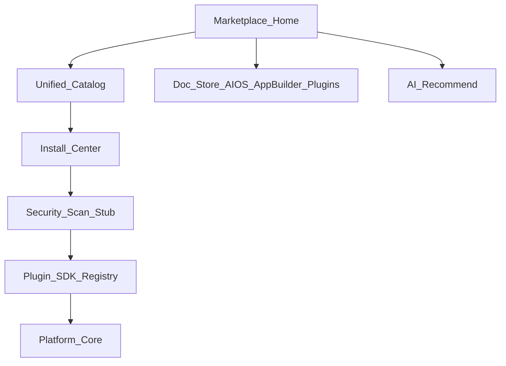

# BachMain Marketplace — Architecture & Roadmap

**Version:** 2026-07-20 Enterprise  
**Companion:** [102 Gap](./102_MARKETPLACE_GAP_REPORT.md)

## Routes

| Path                         | Purpose             |
| ---------------------------- | ------------------- |
| `/marketplace`               | Marketplace Home    |
| `/magaza`                    | Alias               |
| `/platform?tab=plugins`      | Plugin registry SoT |
| `/belge-merkezi/marketplace` | Document packs SoT  |

## Hub tabs

Discover · Featured · Industry · Applications · AI Agents · Extensions · Integrations · Workflow · Documents · Dashboards · Themes · Printers · Languages · Developer · Partner · Installed · Updates · Licenses · Reviews · Enterprise · AI Recommend · Assets

## API (MP-0)

| Method | Path                        | Purpose                 |
| ------ | --------------------------- | ----------------------- |
| GET    | `/v1/marketplace/catalog`   | Full catalog            |
| GET    | `/v1/marketplace/overview`  | KPIs + featured         |
| GET    | `/v1/marketplace/installed` | Tenant installs         |
| POST   | `/v1/marketplace/install`   | Install stub (plugin)   |
| POST   | `/v1/marketplace/uninstall` | Uninstall stub          |
| GET    | `/v1/marketplace/recommend` | AI recommend heuristics |

## Phases

| Phase    | Scope                                              |
| -------- | -------------------------------------------------- |
| **MP-0** | Hub · catalog · install stub · AI recommend · docs |
| MP-1     | Compatibility · security scan · updates            |
| MP-2     | Licenses · Partner Center · cloud sync             |

## Compatibility

App Builder publishes _into_ Marketplace catalog intent. Document/AIOS store tabs remain; Marketplace is the **central Discover** surface.
