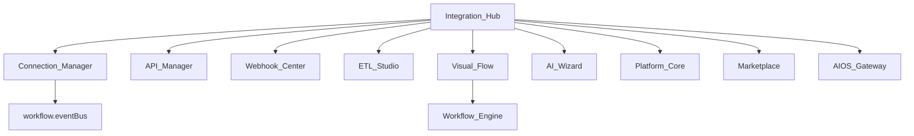

# BachMain Enterprise Integration Hub — Architecture & Roadmap

**Version:** 2026-07-20 Enterprise  
**Companion:** [104 Gap](./104_INTEGRATION_HUB_GAP_REPORT.md)

## Routes

| Path                            | Purpose                    |
| ------------------------------- | -------------------------- |
| `/entegrasyon`                  | Integration Hub Home       |
| `/integration-hub`              | English alias              |
| `/platform?tab=integrations`    | Platform registry SoT      |
| `/marketplace?tab=integrations` | Discover packs SoT         |
| `/otomasyon`                    | Workflow / visual flow SoT |
| `/mesajlar`                     | WhatsApp SoT               |
| `/ayarlar/ai/openai`            | OpenAI SoT                 |
| `/ticaret`                      | Commerce channels SoT      |

## Hub tabs

Dashboard · Connections · API Manager · Webhooks · ETL · EDI · File Transfer · Scheduler · Queues · Transform · Monitoring · Logs · Retry · AI Wizard · Flow Builder · Marketplace · Security · Docs · Sandbox · Settings

## API (IH-0)

| Method | Path                           | Purpose            |
| ------ | ------------------------------ | ------------------ |
| GET    | `/v1/integrations/overview`    | KPIs               |
| GET    | `/v1/integrations/catalog`     | Connector catalog  |
| GET    | `/v1/integrations/connections` | Tenant connections |
| POST   | `/v1/integrations/connect`     | Connect stub       |
| POST   | `/v1/integrations/disconnect`  | Disconnect stub    |
| POST   | `/v1/integrations/wizard`      | AI wizard draft    |
| GET    | `/v1/integrations/webhooks`    | Webhook stubs      |
| GET    | `/v1/integrations/retries`     | Failed jobs stub   |

## Phases

| Phase    | Scope                                                          |
| -------- | -------------------------------------------------------------- |
| **IH-0** | Hub · catalog · connect stub · wizard · monitoring KPIs · docs |
| IH-1     | OAuth · webhook engine · ETL mapping · sandbox                 |
| IH-2     | EDI · bank/shipping/IoT · OpenAPI export                       |

## Compatibility

Platform keeps thin registry. Marketplace discovers packs. Workflow remains the automation SoT — Flow Builder deep-links `/otomasyon/designer`. Billing webhooks stay API-owned.
