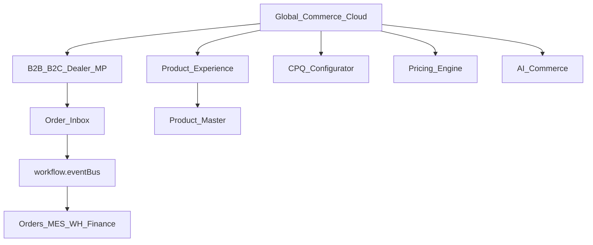

# BachMain Global Commerce Cloud — Architecture & Roadmap

**Version:** 2026-07-20 Enterprise  
**Companion:** [106 Gap](./106_GLOBAL_COMMERCE_CLOUD_GAP_REPORT.md) · [76/77 Foundation](./76_COMMERCE_PLATFORM_GAP_REPORT.md)

## Routes

| Path                            | Purpose                    |
| ------------------------------- | -------------------------- |
| `/ticaret`                      | Global Commerce Cloud Home |
| `/commerce`                     | English alias              |
| `/bayi`                         | → `/ticaret?tab=dealer`    |
| `/siparisler`                   | ERP Orders SoT             |
| `/teklifler`                    | Quotes / CPQ SoT           |
| `/stok/urunler`                 | Product Master SoT         |
| `/entegrasyon`                  | Channel adapters ops       |
| `/marketplace?tab=applications` | Commerce packs             |

## Hub tabs (elevated)

Dashboard · Products · Categories · Brands · Collections · Experience · Configurator · CPQ · B2B · B2C · Dealer · Customer · Supplier · Quotes · Orders · Subscriptions · Campaigns · Coupons · Gift Cards · Loyalty · Pricing · Product AI · AI Commerce · Stock Sync · Shipping · Payments · Returns · Checkout · Global · Showroom · Marketplace · Analytics · Settings

## API

Existing `/v1/commerce/*` remains SoT. Overview `phase` → `GC-Cloud`. No duplicate commerce API surface.

## Phases

| Phase        | Scope                                                             |
| ------------ | ----------------------------------------------------------------- |
| GC-0/1       | Done — channels, inbox, price, Product AI (76/77)                 |
| **GC-Cloud** | Hub elevation · SoT strip · portal/CPQ/loyalty tabs · `/bayi` fix |
| GC-2         | Live adapters · CPQ engine · checkout/loyalty                     |
| GC-3         | AR/3D PDP · multi-company storefront · ROAS                       |

## Compatibility

Document Marketplace ≠ Commerce marketplace channels. Integration Hub operates connectors; Commerce owns channel listings + inbox.
