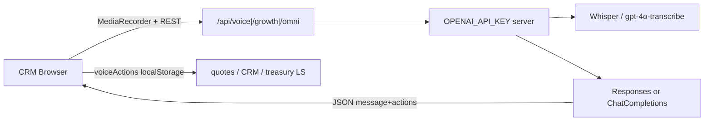
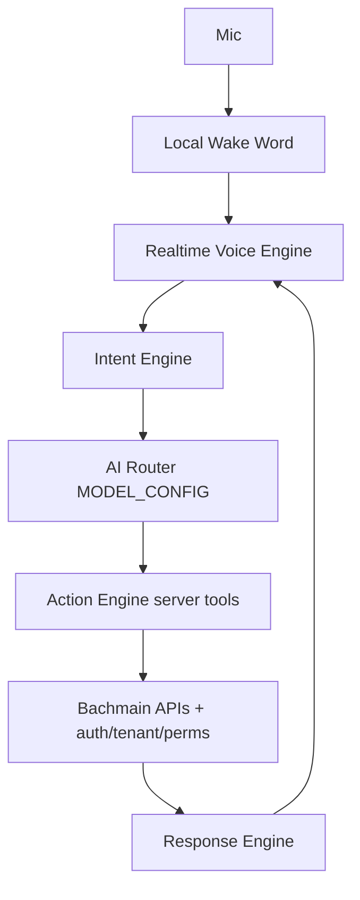

# Bach AI V2 — Current State Report (Phase 1)

**Date:** 2026-08-08  
**Scope:** Readonly codebase verification for Bach AI V2 planning (A–K).  
**Companion plan:** `.cursor/plans/bach_ai_v2_plan_62460ec1.plan.md` (not edited by this phase).  
**Constraints of this phase:** documentation only — no package installs, refactors, deletions, or breaking changes.

> **Doc number note:** `docs/114_BACHY_EXPERIENCE_SYSTEM.md` already exists under the same numeric prefix. This file is the Bach AI V2 Phase 1 deliverable named by the plan (`114_BACH_AI_V2_CURRENT_STATE_REPORT.md`). Treat them as sibling docs under `114_*`, not replacements.

---

## Executive summary

BachMain’s **live CRM voice path** is a browser push-to-talk stack: MediaRecorder → base64 JSON → Express/Vercel `/api/voice/*` → OpenAI (Whisper STT + Responses or Chat Completions) → prompt-shaped JSON `{ message, actions[] }` → **client-side** `executeVoiceActions` writing **localStorage** (customers, quotes, CRM, treasury).

There is **no** OpenAI Realtime / WebRTC voice session, **no** server-side tool calling with auth/tenant, and **no** wake-word state machine. Parallel AI surfaces exist (`src/ai/*` headless core, `apps/api` AIOS gateway, `/api/growth/*`, `/api/omni/*`) but are **not** wired as the CRM voice action executor.

Phase 0 JSON hotfix for Responses API `json_object` (input must contain `"json"`) is **already present** in `server/openaiModels.js` (`buildResponsesBody`). Phase 1 does not change code.

---

## File path map (voice / OpenAI)

| Layer | Path | Role |
| ----- | ---- | ---- |
| Model router (server) | `server/openaiModels.js` | Defaults (`gpt-5.5-pro`), Luna/Terra/Sol tiers, `usesResponsesApi`, `buildResponsesBody` / `buildChatCompletionBody`, `createOpenAiCompletion` |
| Voice chat | `server/voiceChat.js` | Large TR `SYSTEM_PROMPT`, `json: true`, `reasoningEffort: 'high'`, returns `{ message, actions }` |
| Voice STT | `server/voiceTranscribe.js` | Multipart → `https://api.openai.com/v1/audio/transcriptions` |
| Env / guard | `server/env.js` | `OPENAI_API_KEY`, prod ignores client keys, optional `AI_PROXY_SECRET`, IP rate limit |
| Local Express | `server/index.js` | `GET/POST /api/voice/{health,transcribe,chat}`, plus omni/growth |
| Vercel adapters | `api/voice/health.js`, `api/voice/transcribe.js`, `api/voice/chat.js` | Thin handlers → `server/voiceChat.js` / transcribe; chat `maxDuration = 300`, body `4mb` |
| Growth / Omni | `server/growthAi.js`, omni handlers via `server/index.js` | Parallel AI proxies sharing model helpers |
| Client API | `src/utils/voiceApi.js` | Health, chat, base64 transcribe to `/api/voice/*` |
| Client settings | `src/utils/voiceSettings.js` | `localStorage` `erlenbox-voice-settings` (key, speakReplies, apiBaseUrl) |
| Action executor | `src/utils/voiceActions.js` | `buildRichVoiceContext` / `buildCustomerVoiceContext`, `executeVoiceActions` → LS stores |
| Task→tier map | `src/utils/aiModelRouter.js` | CRM/voice tasks → `luna` / `terra` / `sol` / `gemini-live` labels |
| Recorder | `src/hooks/useVoiceRecorder.js` | MediaRecorder push-to-talk → `transcribeVoiceBlob` |
| TTS | `src/hooks/useSpeechSynthesis.js` | Browser `speechSynthesis` (tr-TR) |
| Header UI | `src/components/Layout/HeaderAiAssistant.jsx` | Primary header AI panel (mic + text + actions) |
| Legacy panel | `src/components/Layout/VoiceAssistant.jsx` | Older floating assistant (same APIs + TTS) |
| Cari row mic | `src/components/Customers/CustomerListVoiceMic.jsx` | Row mic → customer-scoped context + Luna |
| Local parse helper | `src/utils/parseCustomerVoiceCommand.js` | Client-side command parse assist (cari mic path) |
| Headless AI core | `src/ai/*` (`src/ai/index.ts`) | Provider registry / config / streaming foundation — **not** the live voice path |
| Platform AIOS | `apps/api/src/modules/aios/*` | Gateway, routes, tools catalogs — platform API, separate from CRM voice |
| Socket.IO | `apps/api/src/realtime/socket.ts` | JWT rooms `user:{sub}`, `company:{cid}` — notifications/support; **not** CRM voice sync |
| iOS stub | `ios/Bachmain/Core/Realtime/RealtimeClient.swift` | Placeholder enum only (`platform = "IOS"`) |
| iOS shell | `ios/Bachmain/**` | Launch/dashboard placeholders; no voice/Realtime session |

---

## A) Mevcut AI mimarisi

### Live CRM path (production-facing)

1. UI collects text or STT transcript.
2. Client POSTs to `/api/voice/chat` with `messages` + rich `context` JSON.
3. Server builds one system message = `SYSTEM_PROMPT` + stringified context (`server/voiceChat.js`).
4. `createOpenAiCompletion` (`server/openaiModels.js`):
   - **`gpt-5.5-pro` (and pro variants)** → OpenAI **Responses API** (`/v1/responses`) with `text.format = json_object`.
   - Other models → **Chat Completions** with `response_format: json_object`.
5. Model returns JSON: `{ message, actions[] }` (prompt contract, not OpenAI tools).
6. Browser runs `executeVoiceActions` — navigate + mutate local stores.

**Default model:** `DEFAULT_OPENAI_CHAT_MODEL = 'gpt-5.5-pro'` with `DEFAULT_OPENAI_REASONING_EFFORT = 'high'`.  
**Tiers:** `AI_MODEL_TIERS` — `luna` / `terra` / `sol` / `gemini-live` (STT slot alias; chat falls back to Luna). Env overrides: `OPENAI_MODEL`, `OPENAI_MODEL_LUNA|TERRA|SOL`, `OPENAI_WHISPER_MODEL`, `OPENAI_REASONING_EFFORT`.

### “Tool calling”

**Absent as OpenAI function/tools.** Actions are prompt-JSON types executed on the client:

- `navigate`, `create_customer`, `create_product`, `create_quote`, `create_task`, `create_appointment`, `create_note`, `create_customer_collection`, `create_customer_payment`

No server-side auth/permission/idempotency gate on those mutations.

### Parallel / unused-for-voice stacks

| Stack | Location | Relation to CRM voice |
| ----- | -------- | --------------------- |
| Bach AI Core | `src/ai/*` | Headless multi-provider core; UI barrel warns “no AI logic in components”; **not** wired into Header/cari mic |
| AIOS | `apps/api/src/modules/aios/` | Platform gateway + catalogs; separate JWT/`cid` world |
| Growth | `/api/growth/*` | Content/chat for growth surfaces |
| Omni | `/api/omni/*` | Analyze proxy |

### Phase 0 status (verified)

`buildResponsesBody` already appends `\n\nReturn a JSON object.` to the last user input (or pushes a user message) when `json === true` and input lacks `/json/i`. This addresses OpenAI 400 when system text lives in `instructions` and the user utterance alone has no `"json"` keyword. Chat Completions path unchanged.

---

## B) Mevcut ses mimarisi

| Concern | Current implementation |
| ------- | ---------------------- |
| Capture | Push-to-talk `MediaRecorder` (`useVoiceRecorder.js`), mime candidates webm/mp4/ogg, max ~90s |
| Transport | Blob → **base64** in JSON body (`voiceApi.transcribeVoiceBlob`) → `POST /api/voice/transcribe` |
| STT | OpenAI audio transcriptions; default `gpt-4o-transcribe`; language `tr` |
| NLU / chat | Separate second request `POST /api/voice/chat` (no streaming) |
| TTS | Browser `speechSynthesis` only (`useSpeechSynthesis.js`) — no OpenAI TTS |
| UI entry points | `HeaderAiAssistant.jsx` (header), `CustomerListVoiceMic.jsx` (cari row), legacy `VoiceAssistant.jsx` |
| Realtime audio | **None** — no WebRTC, no OpenAI Realtime session, no continuous listening |
| Wake word | **None** — explicit mic press only |

Customer row mic scopes context via `buildCustomerVoiceContext` (`mode: 'customer_row_voice'`, `activeCustomer` + balance) so tahsilat/ödeme bind to that cari.

---

## C) Mevcut API mimarisi

### Endpoints (CRM server / Vercel)

| Method | Path | Handler |
| ------ | ---- | ------- |
| GET | `/api/voice/health` | Key present?, resolved chat/transcribe models, reasoning, `clientKeysAllowed` |
| POST | `/api/voice/transcribe` | `handleVoiceTranscribeRequest` |
| POST | `/api/voice/chat` | `handleVoiceChatRequest` |
| GET/POST | `/api/omni/*`, `/api/growth/*` | Parallel AI proxies |

Local Express: `server/index.js`. Production serverless: `api/voice/*.js` re-exporting server modules.

### Auth / tenancy on AI proxy

- **No** CRM session JWT / `cid` / branch / package checks on `/api/voice/*`.
- Optional shared secret: `AI_PROXY_SECRET` via `x-ai-proxy-secret` or Bearer (`assertAiProxyAuthorized`).
- In-memory IP rate limit: `hitAiRateLimit` (~60/min default).
- Production: server `OPENAI_API_KEY` only; client-supplied keys ignored (`resolveRequestApiKey` / `getOpenAiApiKey`).
- Dev: optional BYOK via body `apiKey` or `X-OpenAI-Key` (settings UI).

### Contrast with `apps/api`

Platform API uses JWT verification for Socket.IO and business routes. CRM voice mutations never go through that gate today.

---

## D) Mevcut database bağlantıları

| Data domain | Voice path persistence |
| ----------- | ---------------------- |
| Customers / products / quotes / tasks / appointments / notes | **Browser `localStorage`** (and related keys) via `customerProfiles`, `productCatalog`, `quotesStore`, `crmStore` |
| Tahsilat / ödeme / ledger | **`treasuryStore`** (local) |
| Voice settings / API key (dev) | `erlenbox-voice-settings` |
| Platform Postgres / multi-tenant CRM | **Not** used by voice action executor |
| Socket.IO sync of offers/collections | **Not** emitted from voice path |

`apps/api` DB + realtime exist for notifications/support/platform modules; **CRM voice is decoupled** from them. Any V2 Action Engine that writes server CRM must introduce authenticated APIs and stop relying solely on LS mutation.

---

## E) Tespit edilen performans sorunları

1. **Large system prompt every turn** — full `SYSTEM_PROMPT` + `JSON.stringify(context)` (up to ~40 customers, ~50 products, ~20 tasks, ~15 appointments/notes).
2. **High reasoning default** — `reasoningEffort: 'high'` on voice chat; Pro model → latency and cost.
3. **Two serial round-trips** — STT then chat; no duplex / streaming reply.
4. **Base64 audio in JSON** — ~33% size overhead; Vercel body limit `4mb` on chat adapter (transcribe also JSON-bound).
5. **No response streaming** — UI waits for full completion.
6. **Client-side mutation risk** — any caller who can hit chat (or forge JSON) can drive LS writes without server permission checks; multi-device / multi-user inconsistent.
7. **In-memory rate limits** — not shared across serverless instances; weak under scale.
8. **Duplicate UI surfaces** — Header + legacy `VoiceAssistant` + cari mic share APIs but diverge UX/TTS wiring → maintenance cost.
9. **Model routing labels vs concrete IDs** — client `resolveAiTaskModel('crm') → 'luna'` still resolves server-side; mis-set `OPENAI_MODEL` to Pro routes all CRM voice through Responses + high effort.

---

## F) Değiştirilmesi gereken dosyalar (V2 — later phases)

**Do not change in Phase 1.** Candidates for Phase 2+:

| Area | Files |
| ---- | ----- |
| Model / JSON plumbing | `server/openaiModels.js` (central config handoff; keep hotfix) |
| Voice chat prompt / effort | `server/voiceChat.js` |
| STT | `server/voiceTranscribe.js` |
| Guards / env | `server/env.js`, `server/index.js`, `api/voice/*` |
| Client API / settings | `src/utils/voiceApi.js`, `voiceSettings.js`, `aiModelRouter.js` |
| Actions | `src/utils/voiceActions.js` (migrate mutations → server tools) |
| UI | `HeaderAiAssistant.jsx`, `CustomerListVoiceMic.jsx`, optionally retire/align `VoiceAssistant.jsx` |
| Hooks | `useVoiceRecorder.js`, `useSpeechSynthesis.js` → Realtime/WebRTC clients |
| **New (planned)** | `server/ai/config.js`, `src/ai/v2/config.*`, Intent + Action Engine routes, Realtime session endpoint, wake-word state machine, Socket.IO CRM events |

---

## G) Korunması gereken dosyalar

Keep stable while V2 lands **in parallel** (existing `/api/voice/*` remains until cutover):

- ERP/CRM pages and routing (`src/pages/*`, `App.jsx` routes).
- Domain stores: quotes, CRM agenda, treasury/customer movement, product catalog, customer profiles — until server APIs replace them with equivalent UX.
- `apps/api` auth (`cid` / JWT), support/notification Socket.IO skeleton (`apps/api/src/realtime/socket.ts`).
- Design-system / CTA / surface panel rules (CRM UI chrome).
- Phase 0 Responses `json_object` input safeguard in `buildResponsesBody`.
- Production Zero Trust rule: never accept browser OpenAI keys in prod (`server/env.js`).

---

## H) Önerilen yeni mimari (V2 target)

### Principles

- AI extracts **intent + slots** only; no SQL/DB dumps in prompts.
- Every tool: **auth + companyId + branch + permissions + package**; confirmation gate for risky writes; idempotency on `create_*`.
- Central config: Luna / Terra / Sol / Realtime mini / Realtime full (env overrides) — Phase 2.
- Keep legacy `/api/voice/*` running during Phases 2–3; add `/api/ai/v2/*` and `/api/ai/realtime/session` beside it.
- Sync: emit tenant-scoped Socket.IO events (`company:{cid}`) with id/metadata; clients refetch.

### Gap vs today

| Capability | Today | V2 |
| ---------- | ----- | --- |
| Tools | Prompt JSON + client LS | Server Action Engine |
| Auth on mutations | None | JWT/`cid`/perms |
| Voice transport | REST STT + chat | Realtime WebRTC (+ WS fallback) |
| Wake word | None | Local detector + silence timeouts |
| TTS | Browser only | Realtime audio out |
| Multi-device sync | LS only | Socket + server source of truth |

---

## I) Web uyumluluğu

| Topic | Finding |
| ----- | ------- |
| Supported today | Chromium/Safari/Firefox with `getUserMedia` + `MediaRecorder` (mime varies; Safari often mp4) |
| TTS | `speechSynthesis` — voice quality OS-dependent; not brand-controlled |
| Hands-free wake | Only feasible while **tab/app foreground**; browsers do not allow reliable background mic for wake word |
| Realtime | Prefer **WebRTC** to OpenAI Realtime; **ephemeral token from backend** (key never in frontend); WS fallback |
| PWA / mobile Safari | Mic permissions + autoplay/TTS restrictions; silence timeouts must be UX-visible (“Bach AI dinliyor…”) |
| Existing CRM | Header + cari mic already ship on web; V2 should additive-feature-flag, not hard-cut `/api/voice` |

---

## J) iOS uyumluluğu

| Topic | Finding |
| ----- | ------- |
| Native shell | `ios/Bachmain` — launch, placeholders, session/health stubs |
| Realtime | `RealtimeClient.swift` is a **stub** (comments: future Socket.IO to `apps/api`; rooms `company:{cid}`, `user:{sub}`) |
| Voice / AVAudioSession | **Not implemented** |
| Privacy | Must use system mic permission; no background mic hack; honest UX when app backgrounded |
| First native slice (Phase 8) | Permission + foreground wake/session bridge to same Realtime session contract as web |
| Siri shortcuts | Explicitly later — out of early V2 |

---

## K) Android uyumluluğu

| Topic | Finding |
| ----- | ------- |
| Native app | **None** in repo (no `android/` project) |
| Near-term | Web CRM (+ optional PWA) only |
| Plan | Web + iOS first; when Android project opens, reuse **same** Realtime session + Action Engine contracts |
| Background wake | OS-restricted; same honesty as iOS — out of scope for App Store–style always-on wake |

---

## Gap checklist (Phase 1 → later)

- [ ] Phase 2 — `AI_CONFIG` / `MODEL_ROUTER` / `VOICE_CONFIG` / `WAKE_WORD_CONFIG`
- [ ] Phase 3 — Intent + Action Engine (`search_customer`, `get_product`, `create_offer_draft`, `get_account_balance`, …)
- [ ] Phase 4 — Ephemeral Realtime session + WebRTC client
- [ ] Phase 5 — Local wake-word state machine + silence timeout + privacy UI
- [ ] Phase 6 — Smart end-of-speech / VAD
- [ ] Phase 7 — Socket.IO CRM sync events
- [ ] Phase 8 — iOS foreground bridge
- [ ] Phase 9 — Safety mapping, audit metadata, QA matrix

---

## Verification method

Readonly inspection of the paths listed in the file map (server voice/OpenAI modules, client voice utils/UI/hooks, `api/voice/*`, `apps/api` realtime + AIOS entrypoints, `ios/Bachmain` Realtime stub). No runtime load tests in this phase.

---

## Phase 1 deliverable

| Item | Status |
| ---- | ------ |
| This report | `docs/114_BACH_AI_V2_CURRENT_STATE_REPORT.md` |
| Code / deps / deletes | None |
| Plan file | Untouched |
