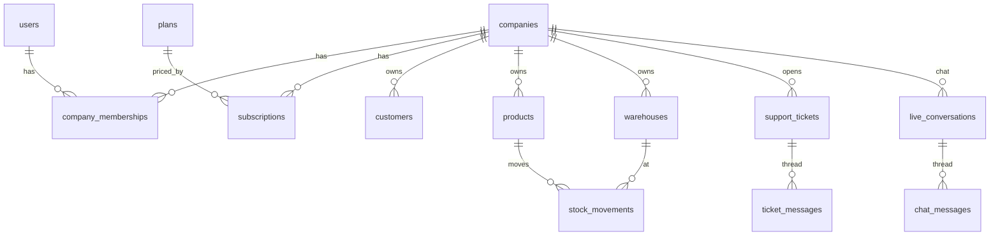

# BachMain Database — Current State Inventory

**Version:** 2026-07-20  
**Rule:** Analysis only — no destructive changes.  
**Sources of truth in code:**

| Plane | Location | Engine | Role today |
|-------|----------|--------|------------|
| A — Platform API (target) | `apps/api/src/db/schema/index.ts` + `apps/api/drizzle/0000_*.sql` | Postgres (Drizzle) | Normalized multi-tenant scaffold |
| B — Admin / Neon live | `apps/admin/server/db.mjs` `ensureSchema()` | Neon Postgres | Production auth/billing + JSON blobs |
| C — CRM runtime | `src/**` + `localStorage` + `tenant_data` JSON | Browser / JSONB | Most ERP/CRM entities (not normalized) |

---

## 1. Plane A — `apps/api` Drizzle schema (33 tables)

### 1.1 Tables

| Table | Purpose | `company_id` | Soft delete (`deleted_at`) |
|-------|---------|--------------|----------------------------|
| `users` | Global identity | — | yes |
| `companies` | Tenant root | — | yes |
| `company_memberships` | User ↔ company | yes (FK) | yes |
| `roles` | Tenant/system roles | optional FK | yes |
| `permissions` | Global permission catalog | — | yes |
| `role_permissions` | M2M | — | yes |
| `refresh_tokens` | Auth sessions (refresh) | — | yes |
| `trusted_devices` | MFA trust | — | yes |
| `mfa_challenges` | MFA OTP | — | yes |
| `email_tokens` | Verify / reset | — | yes |
| `plans` | Billing catalog | — | yes |
| `subscriptions` | Tenant subscription | yes | yes |
| `payments` | Provider payments | yes | yes |
| `invoices` | SaaS invoices (billing) | yes | yes |
| `webhook_events` | Idempotent webhooks | — | yes |
| `leads` | Marketing demos | optional | yes |
| `customers` | CRM customers (thin) | yes | yes |
| `suppliers` | Purchasing | yes | yes |
| `categories` | Product categories | yes | yes |
| `products` | Catalog | yes | yes |
| `warehouses` | Warehouses | yes | yes |
| `stock_movements` | Stock in/out | yes | yes |
| `support_tickets` | Support | yes | yes |
| `ticket_messages` | Ticket thread | — (via ticket) | yes |
| `live_conversations` | Live chat | yes | yes |
| `chat_messages` | Chat thread | — (via conversation) | yes |
| `notifications` | User notifications | optional | yes |
| `activity_logs` | Activity | optional | yes |
| `audit_logs` | Audit | — | yes |
| `files` | File meta | optional | yes |
| `api_keys` | Tenant API keys | yes | yes |
| `system_settings` | KV settings | optional | yes |
| `feature_flags` | Global flags | — | yes |

### 1.2 Foreign keys (explicit `.references`)

```
company_memberships.company_id → companies.id
company_memberships.user_id → users.id
roles.company_id → companies.id
role_permissions.role_id → roles.id
role_permissions.permission_id → permissions.id
refresh_tokens.user_id → users.id
trusted_devices.user_id → users.id
mfa_challenges.user_id → users.id
email_tokens.user_id → users.id
subscriptions.company_id → companies.id
subscriptions.plan_id → plans.id
payments.company_id → companies.id
payments.subscription_id → subscriptions.id
invoices.company_id → companies.id
invoices.payment_id → payments.id
leads.company_id → companies.id
customers.company_id → companies.id
suppliers.company_id → companies.id
categories.company_id → companies.id
products.company_id → companies.id
products.category_id → categories.id
warehouses.company_id → companies.id
stock_movements.company_id → companies.id
stock_movements.warehouse_id → warehouses.id
stock_movements.product_id → products.id
support_tickets.company_id → companies.id
support_tickets.created_by_user_id → users.id
support_tickets.assigned_to_user_id → users.id
ticket_messages.ticket_id → support_tickets.id
ticket_messages.author_user_id → users.id
live_conversations.company_id → companies.id
live_conversations.customer_user_id → users.id
live_conversations.agent_user_id → users.id
chat_messages.conversation_id → live_conversations.id
chat_messages.author_user_id → users.id
notifications.user_id → users.id
notifications.company_id → companies.id
activity_logs.company_id → companies.id
activity_logs.user_id → users.id
audit_logs.actor_user_id → users.id
files.company_id → companies.id
files.uploaded_by_user_id → users.id
api_keys.company_id → companies.id
system_settings.company_id → companies.id
```

**Missing FK (schema smell):** `categories.parent_id` is UUID without `.references(() => categories.id)`.

### 1.3 Indexes (declared in Drizzle)

| Index | Columns |
|-------|---------|
| `users_email_uidx` | email UNIQUE |
| `companies_slug_uidx` | slug UNIQUE |
| `membership_company_user_uidx` | (company_id, user_id) UNIQUE |
| `membership_user_idx` | user_id |
| `roles_company_code_uidx` | (company_id, code) UNIQUE |
| `permissions_code_uidx` | code UNIQUE |
| `role_perm_uidx` | (role_id, permission_id) UNIQUE |
| `refresh_tokens_user_idx` | user_id |
| `trusted_devices_user_hash_uidx` | (user_id, device_hash) UNIQUE |
| `trusted_devices_user_idx` | user_id |
| `mfa_challenges_user_idx` | user_id |
| `plans_code_uidx` | code UNIQUE |
| `subscriptions_company_idx` | company_id |
| `payments_company_idx` | company_id |
| `invoices_number_uidx` | number UNIQUE |
| `webhook_provider_event_uidx` | (provider, event_id) UNIQUE |
| `leads_email_idx` | email |
| `customers_company_idx` | company_id |
| `suppliers_company_idx` | company_id |
| `categories_company_idx` | company_id |
| `products_company_idx` | company_id |
| `warehouses_company_idx` | company_id |
| `stock_movements_company_idx` | company_id |
| `tickets_company_status_idx` | (company_id, status) |
| `ticket_messages_ticket_idx` | ticket_id |
| `live_conversations_company_idx` | company_id |
| `chat_messages_conversation_idx` | conversation_id |
| `notifications_user_idx` | user_id |
| `activity_logs_company_created_idx` | (company_id, created_at) |
| `files_company_idx` | company_id |
| `api_keys_company_idx` | company_id |
| `settings_company_key_uidx` | (company_id, key) UNIQUE |
| `feature_flags_key_uidx` | key UNIQUE |

**Not indexed (but FK exists):** e.g. `stock_movements.warehouse_id`, `stock_movements.product_id`, `payments.subscription_id`, `invoices.payment_id`, `products.category_id`, `email_tokens.user_id`, `audit_logs.actor_user_id`.

### 1.4 Global column standards (Plane A)

| Standard field | Present? |
|----------------|----------|
| `id` UUID | Yes (all) |
| `company_id` | Most tenant tables; not on child threads (`ticket_messages`, `chat_messages`) |
| `branch_id` | **Never** |
| `warehouse_id` | Only `stock_movements` |
| `created_by` / `updated_by` | **No** (tickets use `created_by_user_id` only) |
| `created_at` / `updated_at` / `deleted_at` | Yes via shared `timestamps` helper |
| `is_active` | **No** (plans uses `active`; companies uses `status`) |
| `version` | **No** |

### 1.5 Enums

`plan_code`, `subscription_status`, `payment_status`, `ticket_status`, `platform_role`

### 1.6 Migration artifacts

- Single baseline: `apps/api/drizzle/0000_melted_jubilee.sql`
- Runner: `apps/api/src/db/migrate.ts` → folder `./drizzle`
- **No** incremental migrations for CRM child tables / branches / AI yet

---

## 2. Plane B — Admin Neon (`ensureSchema`) — 10 tables

These run in production when `DATABASE_URL` is set on admin.

| Table | PK | Notes |
|-------|-----|--------|
| `app_state` | `id TEXT` | Giant JSONB payload (modules, accounts, …) |
| `staff_users` | `id TEXT` | Admin staff; no soft delete |
| `tenant_data` | `(tenant_code, collection)` | CRM dual-write JSON collections |
| `payment_events` | `id TEXT` | Stripe/manual events |
| `auth_rate_limits` | `key TEXT` | Auth throttling |
| `subscription_plans` | `id TEXT` | Billing catalog mirror |
| `addon_modules` | `id TEXT` | Addons |
| `billing_subscriptions` | `id TEXT` | `customer_id` TEXT (not UUID FK) |
| `billing_payments` | `id TEXT` | |
| `billing_history` | `id TEXT` | |

**FK / indexes:** essentially none beyond PRIMARY KEY / UNIQUE on codes. No `company_id` UUID tenancy model. No `deleted_at`.

---

## 3. Plane C — CRM operational data (not SQL tables)

Authoritative for day-to-day ERP/CRM UI:

- `localStorage` keys (customers, tasks, quotes, production, logistics, …)
- Optional mirror: `tenant_data.payload` JSONB by `(tenant_code, collection)`
- Helpers: `src/utils/tenantSync.js`, `crmApiDualWrite.js` (gated)

**Implication:** Spec sections 4–16 (CRM children, projects, production, logistics, accounting, AI, …) mostly **do not exist as SQL tables** yet — they exist as client JSON shapes.

---

## 4. Dual-schema collision risks

| Concept | Plane A | Plane B | Risk |
|---------|---------|---------|------|
| Subscriptions | `subscriptions` + `plans` UUID | `billing_subscriptions` + `subscription_plans` TEXT | Duplicate billing models |
| Payments | `payments` | `billing_payments` / `payment_events` | Event vs ledger split |
| Users | `users` UUID | `staff_users` + `app_state.accounts` | Three identity stores |
| Customers | thin `customers` | JSON in CRM / `tenant_data` | Divergence during cutover |
| Invoices | SaaS `invoices` | Future sales invoices (missing) | Name collision when sales invoices land |

---

## 5. ERD (Plane A — as implemented)



---

## Related docs

- Gap: [57_DATABASE_GAP_REPORT.md](./57_DATABASE_GAP_REPORT.md)
- Migration plan: [58_DATABASE_MIGRATION_PLAN.md](./58_DATABASE_MIGRATION_PLAN.md)
- Architecture: [ENTERPRISE-SAAS-ARCHITECTURE.md](./ENTERPRISE-SAAS-ARCHITECTURE.md)
