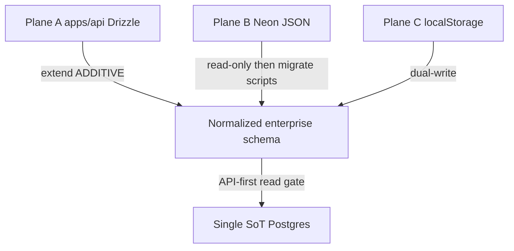

# BachMain Database — Migration Plan (Backward Compatible)

**Version:** 2026-07-20  
**Principles:** Do not break production · Additive migrations only · No table drops · Dual-write before cutover · Docs-first  

**Inputs:** [56 Current State](./56_DATABASE_CURRENT_STATE.md) · [57 Gap](./57_DATABASE_GAP_REPORT.md) · [54 CRM Cutover](./54_CRM_TENANT_CUTOVER.md)

---

## 0. Strategy overview



| Rule | Detail |
|------|--------|
| Tooling | Drizzle migrations under `apps/api/drizzle/` only for Plane A |
| Plane B | Keep `ensureSchema` IF NOT EXISTS; add columns carefully; deprecate via freeze date |
| Naming | Prefer new tables; when collide, add **compat VIEW** before rename |
| Default filter | App middleware `requireTenant` + later optional Postgres RLS |
| Pagination | All list APIs `limit`+`cursor`/`offset` from day one on new routes |

---

## 1. Shared column kit (apply to new + gradually to old)

Every **new** tenant table MUST include:

```sql
id              UUID PRIMARY KEY DEFAULT gen_random_uuid(),
company_id      UUID NOT NULL REFERENCES companies(id),
branch_id       UUID NULL REFERENCES branches(id),      -- after branches exist
warehouse_id    UUID NULL,                              -- when domain needs it
created_by      UUID NULL REFERENCES users(id),
updated_by      UUID NULL REFERENCES users(id),
created_at      TIMESTAMPTZ NOT NULL DEFAULT now(),
updated_at      TIMESTAMPTZ NOT NULL DEFAULT now(),
deleted_at      TIMESTAMPTZ NULL,
is_active       BOOLEAN NOT NULL DEFAULT true,
version         INTEGER NOT NULL DEFAULT 1
```

**Backward-compatible ALTER for existing Plane A tables (non-breaking):**

1. Add nullable `created_by`, `updated_by`, `is_active`, `version`, `branch_id`  
2. Backfill `is_active = true`, `version = 1`  
3. Add indexes `(company_id, deleted_at)`, FK indexes missing today  
4. Do **not** make `company_id` NOT NULL on tables where NULL is intentional (leads, notifications, feature flags)

---

## 2. Phased migrations

### Phase M0 — Hygiene (1 sprint, zero feature break)

**Goal:** Safer indexes + naming clarity without new modules.

| Change | Type | Risk |
|--------|------|------|
| Add missing FK indexes (`product_id`, `warehouse_id`, `subscription_id`, …) | CREATE INDEX CONCURRENTLY* | Low |
| Add `(company_id, deleted_at)` on tenant tables | INDEX | Low |
| `categories.parent_id` → self-FK | FK | Low |
| Document SaaS `invoices` as billing-only | Docs | None |
| Compat VIEW `billing_invoices` → `invoices` | VIEW | Low |

\*On Neon, prefer regular `CREATE INDEX` in maintenance window if CONCURRENTLY unsupported in transaction.

**Acceptance:** Existing API login, customers list, Stripe webhook, admin health unchanged.

---

### Phase M1 — Org tree + standard columns

| New tables | Purpose |
|------------|---------|
| `branches` | Multi-branch |
| `user_roles` | Replace TEXT role on membership gradually |
| `company_settings` | Typed settings (keep `system_settings` as fallback) |
| `company_branding` | Logo, colors |
| `company_domains` | Custom domains |
| `sessions` | Optional richer session meta alongside `refresh_tokens` |

| ALTER | Tables |
|-------|--------|
| Add standard nullable columns | All Plane A tenant tables |

**Cutover:** Memberships keep `role` TEXT; writers dual-write `user_roles` when flag on.

---

### Phase M2 — CRM normalized (highest business value)

Align with [54](./54_CRM_TENANT_CUTOVER.md).

| Wave | Tables |
|------|--------|
| 2a | Extend `customers` (type, status, search_document) |
| 2b | `customer_addresses`, `customer_contacts`, `customer_notes`, `customer_tags`, `customer_categories` |
| 2c | `customer_activities`, `customer_tasks`, `customer_meetings` |
| 2d | `customer_files`, `customer_contracts`, `customer_credit_limits`, `customer_balance` |

**Data move:**

1. Dual-write from CRM stores → API  
2. Import script: `tenant_data` / local export → SQL  
3. Read-from-API only after row-count + checksum gate  

**Do not delete** `tenant_data` until 30 days post cutover.

---

### Phase M3 — Sales + tasks + calendar

| Tables | Notes |
|--------|-------|
| `quotations`, `quotation_items` | Map from CRM quote JSON |
| `orders`, `order_items` | |
| `tasks`, `task_*`, `kanban_*` | Map from `bach-crm-tasks` |
| `calendar_events`, `appointments`, `reminders` | |

Rename conflict avoidance: sales documents never reuse SaaS `invoices` name → use `sales_invoices` / `ar_invoices`.

---

### Phase M4 — Stock / warehouse depth

| Tables | Notes |
|--------|-------|
| `product_variants`, `product_images`, `brands`, `units` | |
| `stock_levels`, `stock_transactions` | Keep `stock_movements` or view-alias |
| `warehouse_zones`, `warehouse_bins`, `warehouse_transfers` | |
| `serial_numbers`, `batch_numbers`, `lot_numbers` | |

---

### Phase M5 — Production + logistics

Create production_* and logistics_* tables **empty first**; enable module flags; migrate from localStorage logistics/production stores per tenant.

---

### Phase M6 — Accounting + document center

| Tables | Notes |
|--------|-------|
| Chart of accounts, bank_*, taxes, exchange_rates | |
| `sales_invoices` / `invoice_items` | Distinct from billing |
| `document_templates`, `template_versions`, … | Ties to BACHMAIN_DOCUMENT_CENTER |

---

### Phase M7 — AI + integrations + workflows

| Tables | Notes |
|--------|-------|
| `ai_conversations`, `ai_messages`, `ai_token_usage`, … | Wire `openaiUsageLog` |
| `integration_providers`, `oauth_tokens`, `sync_jobs`, `sync_logs` | |
| `workflows`, `approval_flows` | |

---

### Phase M8 — Plane B retirement

1. Freeze writes to `app_state` modules that are migrated  
2. ETL scripts → Plane A  
3. Keep read fallback 1 release  
4. Mark tables deprecated in docs; drop only after explicit approval (separate change control)

---

## 3. Index policy (all new tables)

Mandatory:

```sql
CREATE INDEX ON <table> (company_id);
CREATE INDEX ON <table> (company_id, deleted_at);
-- plus domain FKs:
CREATE INDEX ON <table> (customer_id);   -- when present
CREATE INDEX ON <table> (product_id);
CREATE INDEX ON <table> (status);        -- when present
CREATE INDEX ON <table> (created_at DESC);
```

Optional later: BRIN on huge append-only logs; hash partition `activity_logs` / `ai_messages` by month or `company_id`.

---

## 4. Security / tenancy

| Layer | Action |
|-------|--------|
| App | Keep `requireTenant` + `company_id` on every mutating query |
| DB (later) | Enable RLS policies `company_id = current_setting('app.company_id')::uuid` |
| Audit | Trigger or service write to `audit_logs` on money/permission tables |
| Soft delete | API DELETE → `deleted_at = now()`; ban hard DELETE on tenant rows |

---

## 5. Search & reporting (design now, implement later)

- Add `search_document tsvector` (or generated) on customers, products, orders  
- Reporting schemas: `reporting.*` views; matviews for heavy KPIs refreshed by cron  

---

## 6. Rollout checklist (each phase)

- [ ] Spec updated in this doc + schema PR  
- [ ] Drizzle migration generated (additive)  
- [ ] Staging migrate + smoke: login, one CRM page, billing webhook  
- [ ] Dual-write flag for any CRM entity touched  
- [ ] Rollback: migration down OR feature flag off (prefer flag)  
- [ ] Production migrate in maintenance window if lock risk  

---

## 7. Explicit non-goals (first 90 days)

- Creating all 150+ empty tables with zero consumers  
- Dropping `app_state` / `tenant_data`  
- Physical deletes of soft-deleted rows  
- Breaking UUID → TEXT id migrations on live admin tables  

---

## 8. Recommended immediate next step (approval gate)

**Implement Phase M0 + M1 only** after explicit OK:

1. Index hygiene migration  
2. `branches` + standard nullable columns  
3. `billing_invoices` VIEW  

Do **not** start M2 CRM table flood until dual-write staging soak is scheduled.

---

## Related

- Security: [53_ENTERPRISE_SECURITY_REPORT.md](./53_ENTERPRISE_SECURITY_REPORT.md)  
- Architecture: [ENTERPRISE-SAAS-ARCHITECTURE.md](./ENTERPRISE-SAAS-ARCHITECTURE.md)
