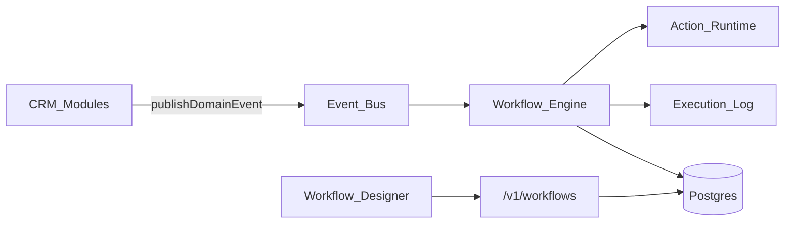

# BachMain Workflow Engine — Architecture & Roadmap

**Version:** 2026-07-16  
**Companion:** [66 Gap Report](./66_WORKFLOW_ENGINE_GAP_REPORT.md)



## Principles

1. **Event-driven** — modules publish; engine matches published workflows by trigger type + scope.
2. **Versioned graphs** — `workflow_versions.graph` JSON (nodes/edges); publish points to a version; rollback = set published pointer.
3. **Tenant scope** — every workflow row has `company_id`; optional `branch_id`, `warehouse_id`, `role_codes`, `package_codes`.
4. **Simulation first** — test mode writes `workflow_runs` with `mode=simulation` and does not call irreversible side effects until allowlisted.
5. **No code duplication** — shared node catalog in CRM + API catalog endpoint.

## Data model (WF-0)

| Table                | Purpose                                                    |
| -------------------- | ---------------------------------------------------------- |
| `workflows`          | Definition header (name, status, scope, published_version) |
| `workflow_versions`  | Immutable graph snapshots (v1, v2, …)                      |
| `workflow_runs`      | One execution (started/completed/failed, mode)             |
| `workflow_run_steps` | Per-node timing + status + error                           |
| `workflow_events`    | Durable domain event / outbox (optional consumer)          |
| `workflow_templates` | Seeded template metadata (or code catalog in WF-0)         |

Graph JSON shape:

```json
{
  "nodes": [
    {
      "id": "n1",
      "type": "trigger",
      "data": { "catalogId": "trigger.customer.created" },
      "position": { "x": 0, "y": 0 }
    }
  ],
  "edges": [{ "id": "e1", "source": "n1", "target": "n2" }]
}
```

## Node categories (color-coded)

| Category     | Color (designer) |
| ------------ | ---------------- |
| TRIGGER      | sky              |
| ACTION       | emerald          |
| CONDITION    | amber            |
| AI           | violet           |
| APPROVAL     | rose             |
| NOTIFICATION | cyan             |
| DOCUMENT     | slate            |
| WAIT         | orange           |
| LOOP         | indigo           |
| CALCULATION  | lime             |
| INTEGRATION  | teal             |
| SYSTEM       | zinc             |

## API surface (WF-0)

| Method | Path                         | Purpose                          |
| ------ | ---------------------------- | -------------------------------- |
| GET    | `/v1/workflows`              | List                             |
| POST   | `/v1/workflows`              | Create + v1                      |
| GET    | `/v1/workflows/:id`          | Detail + versions                |
| PATCH  | `/v1/workflows/:id`          | Meta / scope                     |
| POST   | `/v1/workflows/:id/versions` | Save new version                 |
| POST   | `/v1/workflows/:id/publish`  | Publish version                  |
| POST   | `/v1/workflows/:id/rollback` | Point published to older version |
| POST   | `/v1/workflows/:id/simulate` | Test run                         |
| GET    | `/v1/workflows/:id/runs`     | Execution logs                   |
| GET    | `/v1/workflows/catalog`      | Node catalog                     |
| GET    | `/v1/workflows/templates`    | Template library                 |
| POST   | `/v1/workflows/events`       | Ingest domain event (outbox)     |

## CRM UI

| Route                     | Role                                          |
| ------------------------- | --------------------------------------------- |
| `/otomasyon`              | Hub: list, templates, rules stub, recent runs |
| `/otomasyon/designer`     | New full-screen designer                      |
| `/otomasyon/designer/:id` | Edit graph                                    |

Designer features (WF-0): infinite pan/zoom, minimap, grid, snap, multi-select, copy/paste, undo/redo, category palette.

## Phases

### WF-0 — Foundation (this sprint)

- Docs 66/67
- Schema + migration `0002_workflow_engine`
- API CRUD + simulate stub + event ingest
- CRM hub + React Flow designer + local draft store
- Node catalog + template library (code)
- Browser `publishDomainEvent` bus

### WF-1 — Runtime glue

- Match published workflows on event type
- Action adapters: notification, task create, webhook
- Wire first triggers: `customer.created`, `quote.approved`, `order.created`

### WF-2 — Approvals + wait

- Approval nodes (role/amount)
- Wait / cron resume via jobs

### WF-3 — Business rules + AI assistant

- Rule DSL → graph compiler
- Natural language → draft workflow

### WF-4 — Enterprise hardening

- Package entitlements, branch/warehouse filters
- Durable worker, retries, DLQ
- Audit + admin observability

## Compatibility

- `workflowStages` unchanged.
- Document Center belge stages unchanged.
- No big-bang module rewrites.
