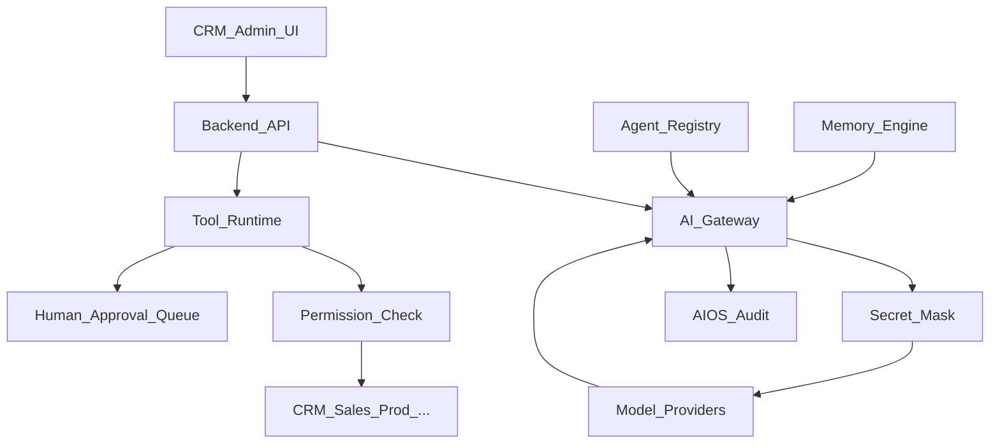

# BachMain AIOS — Architecture & Roadmap

**Version:** 2026-07-20 Enterprise  
**Companion:** [68 Gap Report](./68_AIOS_GAP_REPORT.md)

## Principles

1. **Zero-trust gateway** — single egress to models; keys only on server.
2. **Multi-provider** — OpenAI, Anthropic, Gemini, Azure OpenAI, local (future). Task → preferred model.
3. **Agents as config** — `agentsCatalog` + optional per-tenant overrides in DB.
4. **Tools only** — no raw SQL from LLM; Zod-validated tool I/O.
5. **Human-in-the-loop** — dangerous tools enqueue approval.
6. **Observable** — every run: who, agent, model, tokens, cost, duration, success, approval flag.

## Data model (AIOS-0)

| Table                | Purpose                                                    |
| -------------------- | ---------------------------------------------------------- |
| `aios_agent_configs` | Tenant overrides (model, limits, modules, schedule window) |
| `aios_runs`          | One agent invocation                                       |
| `aios_run_steps`     | Tool calls / model hops                                    |
| `aios_approvals`     | Pending/approved/rejected high-risk actions                |
| `aios_memory`        | Scoped memory entries (masked)                             |
| `aios_schedules`     | Cron / one-shot / event schedules                          |

## API surface (AIOS-0)

| Method   | Path                            | Purpose                           |
| -------- | ------------------------------- | --------------------------------- |
| GET      | `/v1/aios/overview`             | Dashboard KPIs                    |
| GET      | `/v1/aios/agents`               | Agent list + status               |
| GET      | `/v1/aios/agents/:id`           | Agent detail                      |
| PATCH    | `/v1/aios/agents/:id`           | Tenant config override            |
| GET      | `/v1/aios/tools`                | Tool library                      |
| GET      | `/v1/aios/providers`            | Model providers health            |
| POST     | `/v1/aios/gateway/chat`         | Authorized chat via gateway       |
| POST     | `/v1/aios/tools/:toolId/invoke` | Invoke tool (or enqueue approval) |
| GET      | `/v1/aios/runs`                 | Usage / logs                      |
| GET      | `/v1/aios/approvals`            | Approval queue                    |
| POST     | `/v1/aios/approvals/:id/decide` | Approve / reject                  |
| GET/POST | `/v1/aios/memory`               | Scoped memory                     |
| GET/POST | `/v1/aios/schedules`            | Agent schedules                   |

## Standard agents (registry)

CEO, Operasyon, Satış, CRM, Üretim, Kalite, Depo, Lojistik, Satın Alma, Muhasebe, Finans, İK, Pazarlama, SEO, Sosyal, Reklam, Tasarım, Belge, Raporlama, Destek, Veri Analisti, Çeviri, Müşteri İletişim — each with role, modules, default model, cost cap.

## Phases

### AIOS-0 — Foundation (shipped)

Docs 68/69 · schema · gateway (OpenAI live + stubs) · catalogs · audit runs · admin Control Center · CRM hub shell · approval stubs

### AIOS-0.5 — Enterprise AI Brain hub

Docs 92/93 · tabbed `/aios` Center · Prompt Studio surface · Model Center (+ DeepSeek/Mistral stubs) · deep-links · localStore · gateway chat from CRM

### AIOS-1 — Tools runtime

Customer search, quote draft, task update, inventory search — real adapters + RBAC

### AIOS-2 — Memory + scheduler

Tenant knowledge base · cron agents · event triggers via Workflow bus

### AIOS-3 — Multi-provider production

Claude / Gemini / Azure keys · routing policies · cost budgets

### AIOS-4 — Deep module glue

Production / logistics / document center tools · Workflow “OpenAI çalıştır” → AIOS gateway

## UI

| Surface                 | Route                               |
| ----------------------- | ----------------------------------- |
| Admin AI Control Center | `/ai-yonetimi` (replaces stub list) |
| CRM AIOS Hub            | `/aios`                             |

## Compatibility

Growth/Voice/Omni keep working. New agent features use `/v1/aios/*` only.
