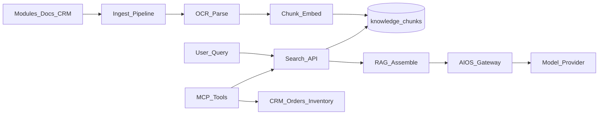

# BachMain Knowledge Platform — Architecture & Roadmap

**Version:** 2026-07-20 Enterprise  
**Companion:** [70 Gap Report](./70_KNOWLEDGE_PLATFORM_GAP_REPORT.md)

## Principles

1. **Single index** — all knowledge types land in `knowledge_documents` + chunks.
2. **RBAC first** — user cannot retrieve what they cannot see (company/branch/warehouse/dept/role).
3. **RAG path** — Knowledge → search → records → prompt → model → answer.
4. **MCP-ready tools** — stable tool IDs (`search_documents`, `search_customer`, …).
5. **Versioned** — every mutate creates a version row; compare old/new.
6. **Modular** — parsers/embedders are pluggable; KP-0 uses lexical + stub vectors.

## Data model (KP-0)

| Table                  | Purpose                                                   |
| ---------------------- | --------------------------------------------------------- |
| `knowledge_documents`  | Header: title, type, category, tags, status, scope, links |
| `knowledge_versions`   | Immutable content snapshots                               |
| `knowledge_chunks`     | Chunk text + stub embedding + search tokens               |
| `knowledge_links`      | Doc ↔ customer/quote/order/…                              |
| `knowledge_faq`        | FAQ entries                                               |
| `knowledge_search_log` | Query analytics                                           |

## API surface (KP-0)

| Method   | Path                                   | Purpose                     |
| -------- | -------------------------------------- | --------------------------- |
| GET      | `/v1/knowledge/overview`               | Dashboard KPIs              |
| GET/POST | `/v1/knowledge/documents`              | List / create (ingest)      |
| GET      | `/v1/knowledge/documents/:id`          | Detail + versions           |
| POST     | `/v1/knowledge/documents/:id/versions` | New version                 |
| POST     | `/v1/knowledge/search`                 | Natural language / lexical  |
| POST     | `/v1/knowledge/rag`                    | Retrieve + assemble context |
| GET      | `/v1/knowledge/mcp/tools`              | MCP tool descriptors        |
| POST     | `/v1/knowledge/mcp/:tool`              | Invoke MCP tool             |
| GET/POST | `/v1/knowledge/faq`                    | FAQ                         |
| GET      | `/v1/knowledge/search-log`             | Top queries                 |

## MCP tools (standardized)

`search_documents`, `search_customer`, `search_orders`, `search_inventory`, `create_quote_draft`, `create_task`, `generate_invoice`, `plan_truck`, `plan_route`, `search_templates`

## Phases

### KP-0 — Foundation (this sprint)

Docs · schema · ingest/search/RAG stubs · MCP catalog · Knowledge Center UI · AIOS tool link

### KP-1 — Parsers + OCR

PDF/DOCX/XLSX text extract · OCR queue · language detect · auto tags

### KP-2 — Embeddings

pgvector or managed embed API · reindex on change · hybrid search

### KP-3 — Auto-index modules

Quotes, orders, warehouse moves, logistics plans dual-write into knowledge

### KP-4 — Assistant actions

Summarize / translate / QA / rewrite via AIOS + scoped retrieval

## UI

| Route                                        | Role                                     |
| -------------------------------------------- | ---------------------------------------- |
| `/bilgi-merkezi`                             | Knowledge Center (tabs for all submenus) |
| Link from `/aios`, Document Center, Settings |                                          |

## Compatibility

Document Center and AIOS unchanged in behavior; Knowledge is the retrieval layer they call.
