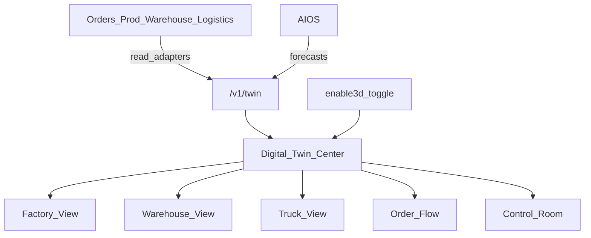

# BachMain Digital Twin — Architecture & Roadmap

**Version:** 2026-07-20 Enterprise  
**Companion:** [72 Gap Report](./72_DIGITAL_TWIN_GAP_REPORT.md)

## Principles

1. **Overlay, not SoT** — Twin never replaces orders/stock tables.
2. **Adapters** — each view pulls from existing stores/API; mock seed in DT-0.
3. **3D optional** — isometric/SVG default; R3F on demand.
4. **Performance** — lazy routes, pause animations off-screen.
5. **Modular views** — add Machine/Quality without rewriting Center shell.

## Data (DT-0 light)

| Table              | Purpose                            |
| ------------------ | ---------------------------------- |
| `twin_preferences` | enable3d, defaultView, layout JSON |
| `twin_snapshots`   | optional KPI snapshot cache        |

## API (DT-0)

| Method    | Path                   | Purpose                     |
| --------- | ---------------------- | --------------------------- |
| GET       | `/v1/twin/overview`    | Live KPI + bottlenecks stub |
| GET/PATCH | `/v1/twin/preferences` | 3D toggle / default view    |
| GET       | `/v1/twin/factory`     | Lines/machines demo state   |
| GET       | `/v1/twin/warehouse`   | Zones fill + heat           |
| GET       | `/v1/twin/flow`        | Order flow stages           |

## UI

| Route           | Role                                                                                                                    |
| --------------- | ----------------------------------------------------------------------------------------------------------------------- |
| `/dijital-ikiz` | Digital Twin Center                                                                                                     |
| Tabs            | Factory, Warehouse, Truck, Pallet, Machine, Production, Order Flow, Customer Flow, Route, Live Monitoring, Control Room |

Truck tab deep-links `/lojistik/yukleme-plani` (existing calculator).

## Phases

### DT-0 — Foundation (this sprint)

Docs · Center UI · isometric factory · warehouse heat · flow animation · twin API stubs · 3D toggle · Control Room

### DT-1 — Live adapters

Wire production jobs, depo locations, logistics shipments into views

### DT-2 — Machines + quality + OEE

### DT-3 — Maps route twin + AI what-if / forecasts

## Compatibility

ERP modules unchanged. Twin is additive visualization.
