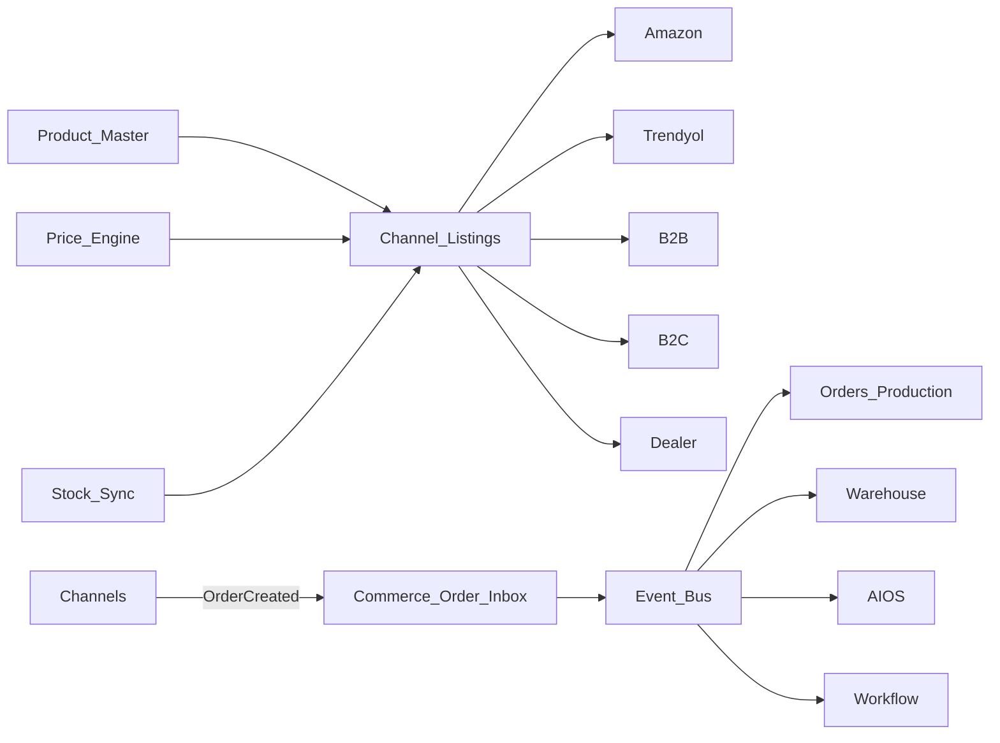

# BachMain Global Commerce — Architecture & Roadmap

**Version:** 2026-07-20 Enterprise  
**Companion:** [76 Gap Report](./76_COMMERCE_PLATFORM_GAP_REPORT.md)

## Principles

1. **Master → publish** — create/edit product once; listings reference `product_id`.
2. **Channel adapters** — each marketplace is a plugin-like adapter (aligns with App Store later).
3. **Price Engine** — resolves price by customer, dealer, country, currency, campaign.
4. **Stock Sync** — ERP stock is source; outbound push to channels (job queue).
5. **Event-driven** — inbox normalize → `commerce.order.received`.

## Data model (GC-0)

| Table                      | Purpose                                            |
| -------------------------- | -------------------------------------------------- |
| `commerce_channels`        | Connected channels (type, status, credentials ref) |
| `commerce_listings`        | product ↔ channel publish state + external ids     |
| `commerce_price_rules`     | dynamic price rules                                |
| `commerce_orders_inbox`    | normalized inbound orders before ERP promote       |
| `commerce_stock_sync_jobs` | sync runs                                          |
| `commerce_product_i18n`    | multi-language product fields                      |

## API (GC-0)

| Method   | Path                                    | Purpose                       |
| -------- | --------------------------------------- | ----------------------------- |
| GET      | `/v1/commerce/overview`                 | Dashboard KPIs                |
| GET      | `/v1/commerce/channels`                 | Channel catalog + connections |
| POST     | `/v1/commerce/channels/:id/connect`     | Stub connect                  |
| GET/POST | `/v1/commerce/listings`                 | List / publish stub           |
| GET/POST | `/v1/commerce/price-rules`              | Price engine rules            |
| GET/POST | `/v1/commerce/orders/inbox`             | Unified orders                |
| POST     | `/v1/commerce/orders/inbox/:id/promote` | Emit event → ERP stub         |
| POST     | `/v1/commerce/stock-sync`               | Enqueue sync job              |
| GET      | `/v1/commerce/catalog/marketplaces`     | Supported marketplaces        |

## UI

| Route      | Role                                   |
| ---------- | -------------------------------------- |
| `/ticaret` | Commerce Center (all submenus as tabs) |

## Phases

### GC-0 — Foundation (this sprint)

Docs · schema · API · Commerce Center · demo channels/orders · price rules · stock sync stub · event promote

### GC-1 — Product publish + i18n + AI content hooks

### GC-2 — Real adapters (Trendyol, Shopify, …) + stock push

### GC-3 — Returns, subscriptions, shipping/payment centers, analytics ROAS

## Integration

CRM · ERP · AIOS · Workflow · Knowledge · Digital Twin — via Event Bus only.
