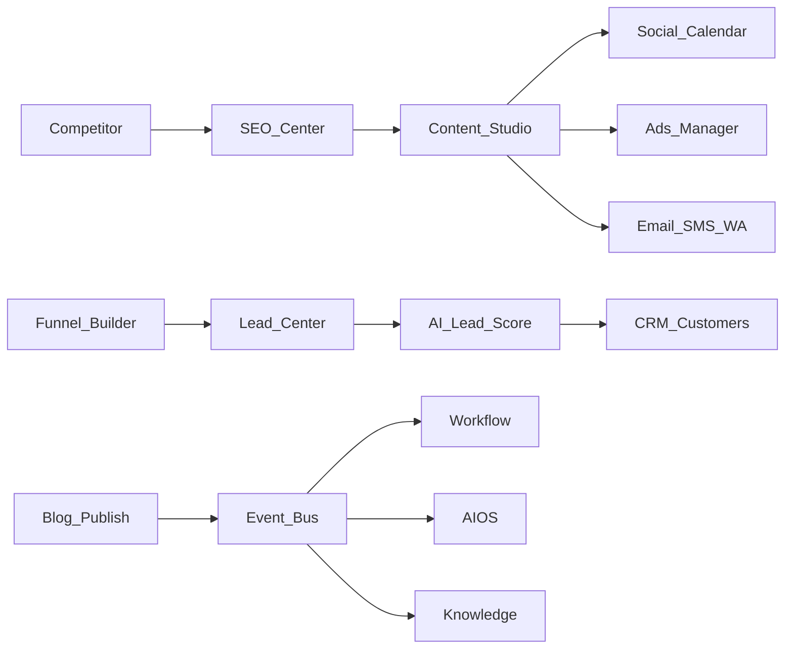

# BachMain AI Growth Center — Architecture & Roadmap

**Version:** 2026-07-20 Enterprise  
**Companion:** [78 Gap Report](./78_AI_GROWTH_CENTER_GAP_REPORT.md)

## Principles

1. **Grow + govern** — AI proposes; human approves when required.
2. **One lead pool** — web, QR, OCR, phone, WA, DM, API → Lead Center.
3. **Content once → many channels** — multi-language expand.
4. **Event-driven automation** — blog published → social → mail → WA → CRM note.
5. **Auditable** — every generate/publish/score writes a growth audit row (AG-0+).

## Data model (AG-0)

| Table                     | Purpose                          |
| ------------------------- | -------------------------------- |
| `growth_leads`            | Unified inbound leads + score    |
| `growth_campaigns`        | Cross-channel campaigns          |
| `growth_content_assets`   | Generated content metadata       |
| `growth_seo_audits`       | SEO audit runs                   |
| `growth_competitors`      | Competitor watchlist             |
| `growth_funnels`          | Funnel definitions (JSON stages) |
| `growth_channel_accounts` | Social/ads connection stubs      |
| `growth_audit_log`        | Operator audit trail             |

## API (AG-0)

| Method   | Path                             | Purpose                   |
| -------- | -------------------------------- | ------------------------- |
| GET      | `/v1/growth/overview`            | Dashboard KPIs            |
| GET/POST | `/v1/growth/leads`               | Lead pool                 |
| POST     | `/v1/growth/leads/:id/score`     | AI score stub             |
| GET/POST | `/v1/growth/campaigns`           | Campaigns                 |
| GET/POST | `/v1/growth/content`             | Content assets            |
| POST     | `/v1/growth/content/expand-i18n` | Multi-lang stub           |
| GET/POST | `/v1/growth/seo/audits`          | SEO audits                |
| GET/POST | `/v1/growth/competitors`         | Competitors               |
| GET/POST | `/v1/growth/funnels`             | Funnels                   |
| GET      | `/v1/growth/catalog`             | Channels, locales, pixels |
| GET      | `/v1/growth/audit`               | Audit log                 |

## UI

Existing `/ai-buyume/*` studios + new routes for Lead, Funnel, SMS, Campaign, Reports, CRM Marketing. Menu aligned to Enterprise IA.

## Phases

### AG-0 — Foundation (this sprint)

Docs · schema · API · menu/IA · KPI dashboard · lead score stub · campaign/funnel shells · workflow triggers · audit log

### AG-1 — Dual-write content library + i18n expand + AIOS tool bridges

### AG-2 — Real social/ads/email/WA adapters + calendar publish

### AG-3 — Landing builder, funnel canvas, pixels, ROAS live feeds

## Integration

Workflow Engine · CRM · AIOS · Knowledge — via Event Bus. Manual path always available.
