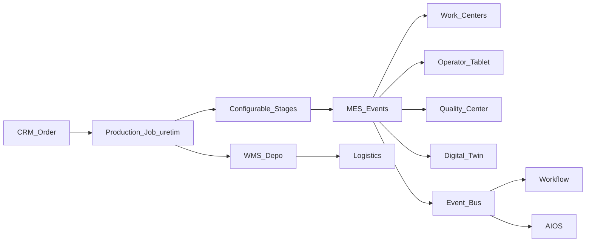

# BachMain MES — Architecture & Roadmap

**Version:** 2026-07-20 Enterprise  
**Companion:** [80 Gap Report](./80_MES_GAP_REPORT.md)

## Principles

1. **Additive** — Manufacturing Center is a sibling of `/uretim`, not a rewrite.
2. **Single job SoT** — commercial job stays in production store / future API dual-write.
3. **Configurable process** — Kanban columns = production workflow stages (settings).
4. **Shop floor first** — Operator tablet actions emit MES events.
5. **Event-driven** — start/pause/finish/scrap/QC → Workflow + Twin + AIOS.

## Data model (MES-0)

| Table              | Purpose                                |
| ------------------ | -------------------------------------- |
| `mes_work_centers` | Machines / cells                       |
| `mes_operators`    | Operator profiles (link user optional) |
| `mes_shifts`       | Shift definitions                      |
| `mes_boms`         | Recipe / BOM headers                   |
| `mes_bom_lines`    | BOM components                         |
| `mes_routings`     | Operation sequences                    |
| `mes_events`       | Execution timeline events              |
| `mes_scrap`        | Scrap / fire records                   |
| `mes_maintenance`  | Maintenance work orders                |
| `mes_oee_samples`  | OEE snapshots                          |
| `mes_evidence`     | Photo/video/pdf attachments meta       |

## API (MES-0)

| Method   | Path                      | Purpose                            |
| -------- | ------------------------- | ---------------------------------- |
| GET      | `/v1/mes/overview`        | Smart dashboard KPIs               |
| GET/POST | `/v1/mes/work-centers`    | Machines                           |
| GET/POST | `/v1/mes/operators`       | Operators                          |
| GET/POST | `/v1/mes/shifts`          | Shifts                             |
| GET/POST | `/v1/mes/boms`            | Recipes                            |
| GET/POST | `/v1/mes/routings`        | Routings                           |
| GET/POST | `/v1/mes/events`          | Timeline events                    |
| POST     | `/v1/mes/operator/action` | start/pause/resume/finish/scrap/qc |
| GET/POST | `/v1/mes/scrap`           | Scrap records                      |
| GET      | `/v1/mes/oee`             | OEE summary                        |
| GET/POST | `/v1/mes/maintenance`     | Maintenance                        |
| GET      | `/v1/mes/ai/insights`     | AI manufacturing stubs             |

## UI

| Route           | Role                                         |
| --------------- | -------------------------------------------- |
| `/mes`          | Manufacturing Center (tabs)                  |
| `/mes/operator` | Operator tablet (full-bleed, large controls) |
| `/uretim*`      | **Unchanged** production jobs                |

## Phases

### MES-0 — Foundation (this sprint)

Docs · schema · API · Manufacturing Center hub · KPI dashboard · machine/operator stubs · operator tablet · kanban view over production jobs · event actions · OEE demo · Twin/Workflow links

### MES-1 — BOM/Routing live · scrap analytics · capacity planner stub · evidence timeline

### MES-2 — AI Quality vision · maintenance predictive · energy · IoT adapters

### MES-3 — Dual-write production jobs to platform DB · Twin live feeds

## UI design

- Minimal iOS-like: large touch targets on operator tablet (min 48px)
- `AppPageShell` / surface panels / day-night tokens
- Responsive: desktop dashboard · tablet operator · mobile summary
