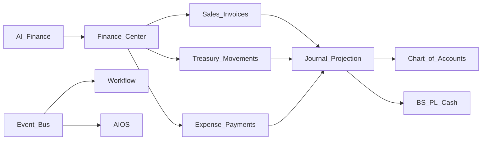

# BachMain Financial Suite — Architecture & Roadmap

**Version:** 2026-07-20 Enterprise  
**Companion:** [82 Gap Report](./82_FINANCE_SUITE_GAP_REPORT.md)

## Principles

1. **Additive hub** — `/finans` overlays; operational UIs stay.
2. **Single cash SoT** — `treasuryStore` / future API dual-write.
3. **Projection, not fork** — GL journals reference `treasuryMovementId` / `invoiceId`.
4. **Event-driven** — postings and AI alerts via Workflow.
5. **Multi-entity ready** — companyId / branchId / currency on FS rows.

## Data model (FS-0)

| Table                     | Purpose                                |
| ------------------------- | -------------------------------------- |
| `finance_accounts`        | Chart of accounts (tek düzen skeleton) |
| `finance_journals`        | Journal headers                        |
| `finance_journal_lines`   | Debit/credit lines                     |
| `finance_budgets`         | Budget headers                         |
| `finance_budget_lines`    | Budget lines                           |
| `finance_cost_entries`    | Cost accounting stubs                  |
| `finance_assets`          | Fixed assets stubs                     |
| `finance_reconciliations` | Bank recon stubs                       |
| `finance_ai_insights`     | Cached AI insight payloads             |

## API (FS-0)

| Method   | Path                                | Purpose                            |
| -------- | ----------------------------------- | ---------------------------------- |
| GET      | `/v1/finance/overview`              | Dashboard KPIs                     |
| GET/POST | `/v1/finance/accounts`              | COA                                |
| GET/POST | `/v1/finance/journals`              | Journals                           |
| POST     | `/v1/finance/journals/project`      | Project from movement/invoice refs |
| GET      | `/v1/finance/reports/balance-sheet` | BS stub                            |
| GET      | `/v1/finance/reports/income`        | P&L stub                           |
| GET/POST | `/v1/finance/budgets`               | Budgets                            |
| GET/POST | `/v1/finance/costs`                 | Cost entries                       |
| GET/POST | `/v1/finance/assets`                | Assets                             |
| GET/POST | `/v1/finance/reconciliations`       | Bank recon                         |
| GET      | `/v1/finance/ai/insights`           | AI finance                         |
| GET      | `/v1/finance/ai/collections`        | AI collection                      |

## UI

| Route                                | Role                              |
| ------------------------------------ | --------------------------------- |
| `/finans`                            | Finance Center (all tabs)         |
| `/efatura`                           | Redirect → `/finans?tab=einvoice` |
| `/nakit/*`, `/giderler/*`, faturalar | **Unchanged**                     |

### Dashboard month-end capacity projection

The dashboard may present two explicitly separated projections without creating a parallel balance:

1. **Current payment capacity:** `treasuryStore` live assets + customer ledger receivables,
   compared with supplier ledger payables + unpaid monthly payroll + unpaid recurring general
   expenses.
2. **Operational conversion scenario:** active orders, production, and undelivered warehouse
   value partitioned by their furthest stage so one commercial value is counted only once.

Operational conversion is a gross cash scenario, not booked revenue, guaranteed collection, or
profit. Invoiced/collected records stay in the current projection and must not be counted again in
the operational scenario.

## Phases

### FS-0 — Foundation (this sprint)

Docs · schema · API · Finance Center · COA seed · journal projection stub · AI finance/collection stubs · BS/P&L demo · deep links to nakit/gider/fatura

### FS-1 — Live projection from treasury · aging · budget vs actual · bank recon UI

### FS-2 — Cost from MES · multi-currency ledgers · e-invoice/e-ledger adapters

### FS-3 — Consolidation · assets depreciation · AI collection automations
