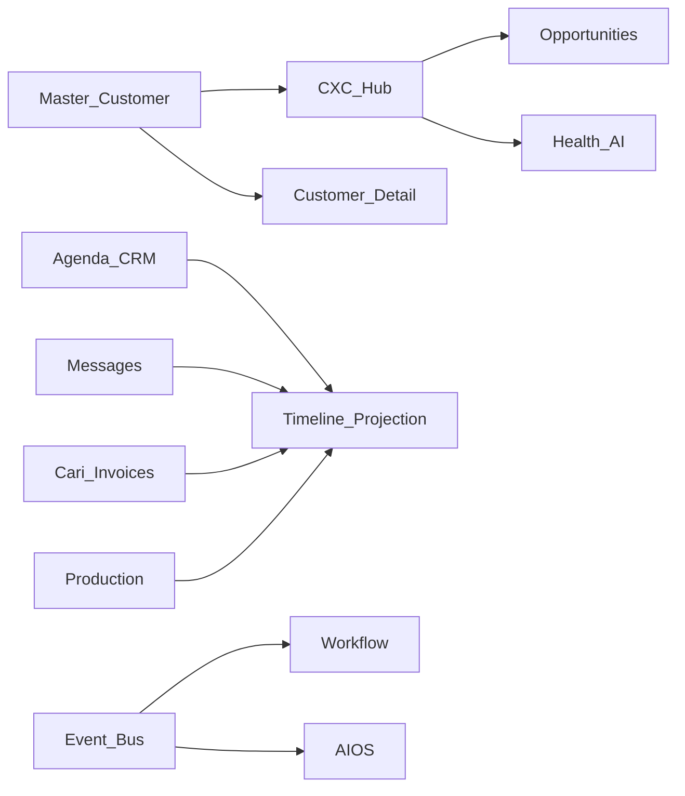

# BachMain Customer Experience Cloud — Architecture & Roadmap

**Version:** 2026-07-20 Enterprise  
**Companion:** [84 Gap Report](./84_CXC_GAP_REPORT.md)

## Principles

1. **Additive hub** — `/musteri-deneyimi` overlays; operational UIs stay.
2. **Single Master Customer** — no fork of profiles.
3. **Projection** — timeline / health / loyalty reference `customerId`.
4. **Event-driven** — create/update/archive/portal/opportunity via Workflow.
5. **Multi-view** — list · kanban · calendar · timeline · map (reuse ProcessWorkspace patterns + field geo).

## Data model (CXC-0)

| Table                 | Purpose                          |
| --------------------- | -------------------------------- |
| `cxc_pipeline_stages` | Configurable sales columns       |
| `cxc_opportunities`   | Pipeline cards → `customerId`    |
| `cxc_timeline_events` | Cached/projected timeline rows   |
| `cxc_health_scores`   | 0–100 health + factors           |
| `cxc_loyalty`         | Tier / points / VIP              |
| `cxc_support_tickets` | Support bridge (not portal fork) |
| `cxc_ai_insights`     | Cached AI insight payloads       |
| `cxc_next_actions`    | AI next-best-action queue        |

## API (CXC-0)

| Method   | Path                              | Purpose                |
| -------- | --------------------------------- | ---------------------- |
| GET      | `/v1/cxc/overview`                | Executive KPIs         |
| GET      | `/v1/cxc/customers/:id/360`       | Customer 360 aggregate |
| GET      | `/v1/cxc/customers/:id/timeline`  | Filterable timeline    |
| GET/POST | `/v1/cxc/pipeline/stages`         | Stages                 |
| GET/POST | `/v1/cxc/opportunities`           | Opportunities          |
| PATCH    | `/v1/cxc/opportunities/:id/stage` | Drag-drop stage move   |
| GET/POST | `/v1/cxc/health`                  | Health scores          |
| GET/POST | `/v1/cxc/loyalty`                 | Loyalty                |
| GET/POST | `/v1/cxc/tickets`                 | Support bridge         |
| GET      | `/v1/cxc/ai/insights`             | AI insights            |
| GET      | `/v1/cxc/ai/next-actions`         | Next actions           |

## UI

| Route                                                 | Role                                 |
| ----------------------------------------------------- | ------------------------------------ |
| `/musteri-deneyimi`                                   | Customer Experience Cloud (all tabs) |
| `/musteriler`, `/crm`, `/mesajlar`, `/ai-buyume/lead` | **Unchanged** SoT / deep links       |

### Hub tabs (CXC-0)

Dashboard · Customers · Companies · Contacts · Lead Center · Sales Pipeline · Activities · Meetings · Calendar · Calls · Emails · WhatsApp · Support · Projects · Contracts · Documents · Invoices · Orders · Timeline · Tasks · Campaigns · AI Insights · Reports · Settings · Loyalty · Executive · Map

## Phases

### CXC-0 — Foundation (this sprint)

Docs · schema · API · Customer Center hub · timeline aggregation (local + API stub) · pipeline drag-drop · health/next-action stubs · smart cards · deep links · workflow triggers

### CXC-1 — Live timeline from CRM/omni/finance/MES · lead convert · support SLA · map routes

### CXC-2 — AI meeting · loyalty live · executive analytics · mobile offline pack

### CXC-3 — Full Salesforce-class automation packs · churn models · competitive risk
