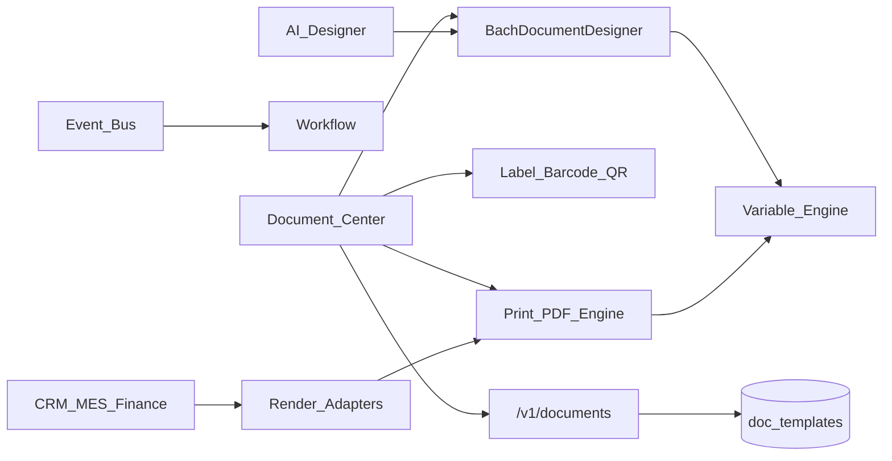

# BachMain Enterprise Document Platform — Architecture & Roadmap

**Version:** 2026-07-20 Enterprise  
**Companion:** [86 Gap Report](./86_DOCUMENT_PLATFORM_GAP_REPORT.md) · `BACHMAIN_DOCUMENT_CENTER/*`

## Principles

1. **Elevate `/belge-merkezi`** — alias `/belge-platformu` → same hub.
2. **Single engine** — `src/documents/engine.js` wraps `docPrint` + variable render.
3. **Additive API** — dual-write ready; local stores remain SoT in DP-0.
4. **No-code first** — variables drag from catalog; no SQL.
5. **Workflow approval** — publish gates via existing Workflow Engine.

## Data model (DP-0)

| Table                   | Purpose                                 |
| ----------------------- | --------------------------------------- |
| `doc_templates`         | Template headers + jsonb design payload |
| `doc_labels`            | Label designs (mm)                      |
| `doc_print_profiles`    | Printer profiles                        |
| `doc_print_jobs`        | Print/PDF job log                       |
| `doc_assets`            | Logos, stamps, images                   |
| `doc_fonts`             | Font registry                           |
| `doc_ai_designs`        | AI prompt → design stubs                |
| `doc_marketplace_items` | Pack catalog stubs                      |

## API (DP-0)

| Method   | Path                           | Purpose          |
| -------- | ------------------------------ | ---------------- |
| GET      | `/v1/documents/overview`       | Hub KPIs         |
| GET/POST | `/v1/documents/templates`      | Templates        |
| GET/POST | `/v1/documents/labels`         | Labels           |
| GET/POST | `/v1/documents/print-profiles` | Profiles         |
| GET/POST | `/v1/documents/print-jobs`     | Jobs             |
| GET/POST | `/v1/documents/assets`         | Assets           |
| GET/POST | `/v1/documents/fonts`          | Fonts            |
| POST     | `/v1/documents/render`         | HTML render stub |
| POST     | `/v1/documents/ai-design`      | AI designer stub |
| GET      | `/v1/documents/marketplace`    | Marketplace      |

## UI

| Route                      | Role                                    |
| -------------------------- | --------------------------------------- |
| `/belge-merkezi`           | Enterprise Document Platform hub (tabs) |
| `/belge-platformu`         | Redirect → `/belge-merkezi`             |
| `/belge-merkezi/tasarimci` | Builder SoT (**unchanged**)             |
| `/belge-merkezi/etiket`    | Label SoT (**unchanged**)               |
| `/belge-merkezi/yazdir`    | Print SoT (**unchanged**)               |

## Phases

### DP-0 — Foundation (this sprint)

Docs · schema · API · hub IA · engine adapter · AI designer stub · variables catalog UI · assets/fonts stubs · marketplace stub · workflow triggers · alias route

### DP-1 — Unify barcode/QR · wire profiles into print · version compare · approval gate · adapter for quotes

### DP-2 — Server PDF · e-sign · localization · printer agent · marketplace install

### DP-3 — Full Canva parity (infinite canvas polish) · CMYK/PDF-A · sector packs
