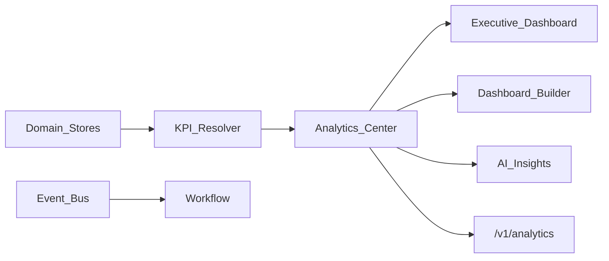

# BachMain Enterprise Analytics Platform — Architecture & Roadmap

**Version:** 2026-07-20 Enterprise  
**Companion:** [88 Gap Report](./88_ANALYTICS_PLATFORM_GAP_REPORT.md)

## Principles

1. **Additive hub** — `/analitik`; `/raporlar` redirects here.
2. **Single SoT metrics** — delegate to treasury/orders/quotes/production/finance/mes/cxc.
3. **Layouts as jsonb** — widgets + positions; no duplicated balances.
4. **ModernDashboard intact** — home stays operational; Executive is Analytics view.

## Data model (AP-0)

| Table                  | Purpose                         |
| ---------------------- | ------------------------------- |
| `analytics_dashboards` | Named dashboards + layout jsonb |
| `analytics_kpis`       | KPI definitions                 |
| `analytics_alerts`     | Threshold alert rules           |
| `analytics_goals`      | Company/dept/user goals         |
| `analytics_okrs`       | OKR headers + key results jsonb |
| `analytics_insights`   | Cached AI insight payloads      |
| `analytics_forecasts`  | Forecast stubs                  |
| `analytics_exports`    | Export job log                  |

## API (AP-0)

| Method   | Path                                  | Purpose            |
| -------- | ------------------------------------- | ------------------ |
| GET      | `/v1/analytics/overview`              | Executive KPIs     |
| GET/POST | `/v1/analytics/dashboards`            | Layouts            |
| PATCH    | `/v1/analytics/dashboards/:id/layout` | Builder save       |
| GET/POST | `/v1/analytics/kpis`                  | KPI catalog        |
| GET/POST | `/v1/analytics/alerts`                | Alerts             |
| GET/POST | `/v1/analytics/goals`                 | Goals              |
| GET/POST | `/v1/analytics/okrs`                  | OKRs               |
| GET      | `/v1/analytics/insights`              | AI insights        |
| GET      | `/v1/analytics/forecasts`             | Forecasts          |
| POST     | `/v1/analytics/exports`               | Export jobs        |
| GET      | `/v1/analytics/board-report`          | AI board pack stub |

## UI

| Route               | Role                        |
| ------------------- | --------------------------- |
| `/analitik`         | Analytics Center (all tabs) |
| `/raporlar`         | Redirect → `/analitik`      |
| `/` ModernDashboard | **Unchanged**               |

## Phases

### AP-0 — Foundation

Docs · schema · API · hub · executive wall · builder stub · KPI/AI/forecast/alerts/goals/OKR stubs · deep-links · fix `/raporlar`

### AP-1 — Live KPI resolve · DnD polish · alerts → Workflow · CSV/XLSX export center

### AP-2 — Data Explorer · Maps · Report Designer · Board Report PDF

### AP-3 — Cockpit TV mode · Watch summaries · realtime websocket feeds
