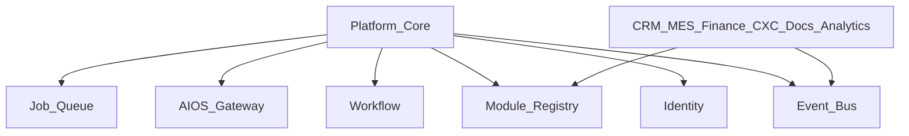

# BachMain Platform Core — Architecture & Roadmap

**Version:** 2026-07-20 Enterprise  
**Companion:** [90 Gap Report](./90_PLATFORM_CORE_GAP_REPORT.md)

## Principles

1. **Additive hub** — `/platform` (+ `/cekirdek` alias).
2. **Deep-link SoT** — never fork Workflow/AIOS/MDM UIs.
3. **Registry only** — `platform_modules` projects known hubs.
4. **Event-driven** — existing catalog is the contract.
5. **Microservice-ready** — clear package boundaries inside monolith.

## Data model (PC-0)

| Table                       | Purpose                                           |
| --------------------------- | ------------------------------------------------- |
| `platform_modules`          | Module registry (code, route, api_prefix, status) |
| `platform_jobs`             | Background job queue stubs                        |
| `platform_health_snapshots` | Dependency health samples                         |
| `platform_integrations`     | Integration registry stubs                        |
| `platform_plugins`          | Plugin registry stubs                             |

Feature flags: use existing `feature_flags` table via `/v1/platform/flags`.

## API (PC-0)

| Method   | Path                          | Purpose               |
| -------- | ----------------------------- | --------------------- |
| GET      | `/v1/platform/overview`       | Rollup                |
| GET/POST | `/v1/platform/modules`        | Registry              |
| PATCH    | `/v1/platform/modules/:code`  | Enable/disable        |
| GET      | `/v1/platform/flags`          | Feature flags         |
| POST     | `/v1/platform/flags`          | Upsert flag           |
| GET      | `/v1/platform/health`         | Composite health      |
| GET/POST | `/v1/platform/jobs`           | Job stubs             |
| GET      | `/v1/platform/events/catalog` | Event bus catalog ids |
| GET      | `/v1/platform/integrations`   | Integration registry  |
| GET      | `/v1/platform/plugins`        | Plugin registry       |

## UI

| Route       | Role                       |
| ----------- | -------------------------- |
| `/platform` | Platform Center (all tabs) |
| `/cekirdek` | Redirect → `/platform`     |
| Domain hubs | **Unchanged**              |

## Phases

### PC-0 — Foundation

Docs · schema · API · hub · module registry seed · jobs/health/flags stubs · event catalog link · installer/license deep-links

### PC-1 — Real jobs worker · files API · flag evaluation · permission hygiene · MDM sync

### PC-2 — Plugin SDK · observability · backup/update centers · GraphQL optional

### PC-3 — Extractable packages (identity/platform/billing) for microservice path
