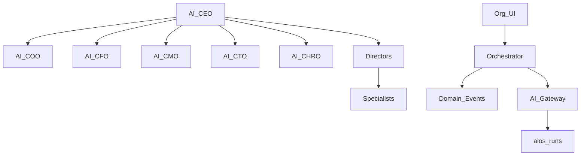

# BachMain AI Enterprise Organization — Architecture & Roadmap

**Version:** 2026-07-20  
**Companion:** [96 Gap](./96_AI_ENTERPRISE_ORG_GAP_REPORT.md)

## Org chart (ORG-0)

AI CEO  
├── AI COO · AI CFO · AI CMO · AI CTO · AI CHRO  
├── Production · Warehouse · Logistics · Sales · CRM  
├── Purchasing · Support · Quality · Analytics · Knowledge

Each node: `agentId`, `reportsTo`, `mandate[]`, `modules[]`, `permissions[]`, `explainWhy`.

## Communication

- No direct agent↔agent chat.
- `POST /v1/aios/organization/dispatch` enqueues orchestrator event → optional gateway briefing → audit run.
- CRM mirrors events in `orgStore` when offline.

## API

| Method | Path                             | Purpose                      |
| ------ | -------------------------------- | ---------------------------- |
| GET    | `/v1/aios/organization`          | Chart + roles                |
| POST   | `/v1/aios/organization/dispatch` | Orchestrator message (event) |

## Phases

| Phase     | Scope                                                     |
| --------- | --------------------------------------------------------- |
| **ORG-0** | Catalog · API · UI · explainability · event dispatch stub |
| ORG-1     | CEO daily briefing job · real tool adapters               |
| ORG-2     | Learning loop from approvals → memory                     |

## Compatibility

Specialist agents remain. Org layer is the **top** AIOS surface; Command Center / AIOS hub deep-link in.
