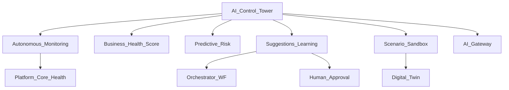

# BachMain AI Autonomous Company — Architecture & Roadmap

**Version:** 2026-07-20  
**Companion:** [98 Gap](./98_AI_AUTONOMOUS_COMPANY_GAP_REPORT.md)

## Routes

| Path                   | Purpose                  |
| ---------------------- | ------------------------ |
| `/ai-otonom`           | Control Tower (flagship) |
| `/autonomous-company`  | Alias                    |
| `/aios?tab=autonomous` | Hub deep-link            |

## API (AC-0)

| Method | Path                                           | Purpose                               |
| ------ | ---------------------------------------------- | ------------------------------------- |
| GET    | `/v1/aios/autonomous/overview`                 | Scores + risks + suggestions + health |
| GET    | `/v1/aios/autonomous/reports/morning`          | Morning executive report              |
| GET    | `/v1/aios/autonomous/reports/evening`          | Evening summary                       |
| POST   | `/v1/aios/autonomous/suggestions/:id/feedback` | accept / reject / edit                |
| POST   | `/v1/aios/autonomous/scenarios/run`            | Sandbox simulation (no SoT write)     |

## Phases

| Phase    | Scope                                                                                        |
| -------- | -------------------------------------------------------------------------------------------- |
| **AC-0** | Catalog · Control Tower · scores · risks · suggestions learning · scenarios · reports · docs |
| AC-1     | Cron health · safe automation executors                                                      |
| AC-2     | Multi-company consolidate                                                                    |

## Compatibility

Command Center = personal day UI. Org = digital workforce. Autonomous Company = **company ops Control Tower**. Twin / Platform / Workflow remain SoT.
