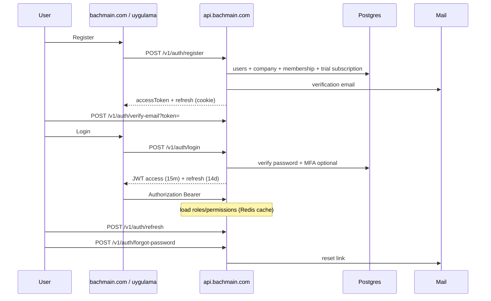
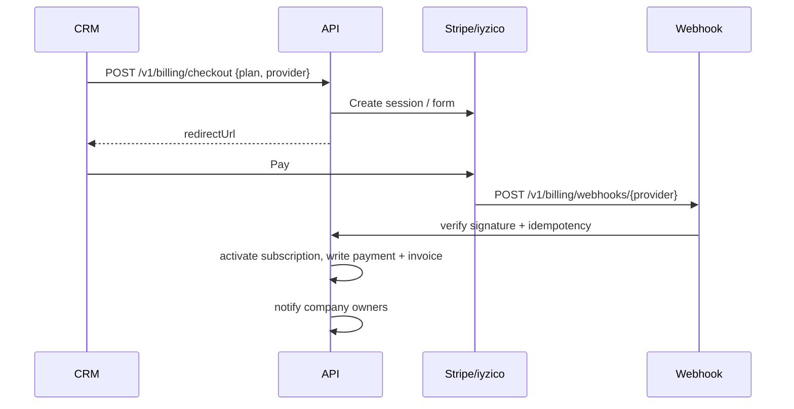
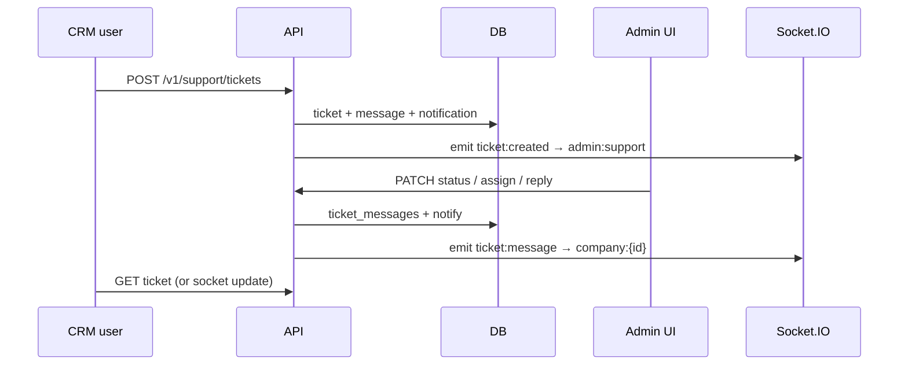
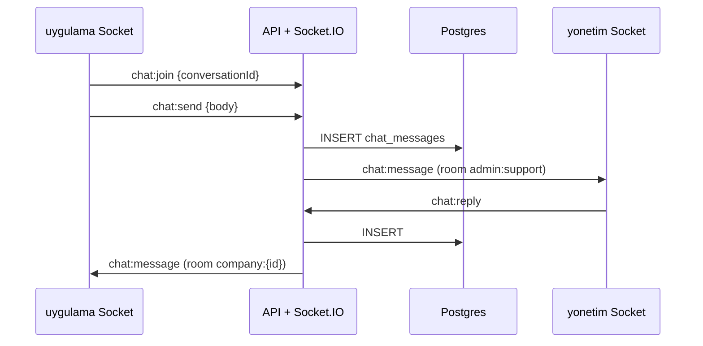

# BachMain Enterprise SaaS Architecture

**Status:** Implementation in progress — `apps/api` scaffold live (auth, billing, leads, support, Socket.IO, CRM customers)  
**Domains:** `bachmain.com` · `uygulama.bachmain.com` · `yonetim.bachmain.com`  
**Principle:** One API · One PostgreSQL · Multi-tenant · No duplicated databases

**Security docs:** [51 Gap Report](./51_ENTERPRISE_SECURITY_GAP_REPORT.md) · [52 Roadmap](./52_ENTERPRISE_SECURITY_ROADMAP.md) · [53 Report](./53_ENTERPRISE_SECURITY_REPORT.md) · [54 CRM Cutover](./54_CRM_TENANT_CUTOVER.md) · [55 Ops/DR](./55_OPS_BACKUP_DR.md)

**DevOps docs (plan paths):** [54 DevOps Gap](./54_ENTERPRISE_DEVOPS_GAP_REPORT.md) · [55 DevOps Roadmap](./55_ENTERPRISE_DEVOPS_ROADMAP.md) · [56 DevOps Report](./56_ENTERPRISE_DEVOPS_REPORT.md) · [62 Branching](./62_BRANCHING_STRATEGY.md) · [63 Staging/Preview](./63_STAGING_AND_PREVIEW.md)

**Database docs:** [56 Current State](./56_DATABASE_CURRENT_STATE.md) · [57 Gap Report](./57_DATABASE_GAP_REPORT.md) · [58 Migration Plan](./58_DATABASE_MIGRATION_PLAN.md)

**MDM docs:** [64 Gap](./64_MDM_GAP_REPORT.md) · [65 Architecture/Roadmap](./65_MDM_ARCHITECTURE_ROADMAP.md)

**Workflow Engine:** [66 Gap](./66_WORKFLOW_ENGINE_GAP_REPORT.md) · [67 Architecture/Roadmap](./67_WORKFLOW_ENGINE_ARCHITECTURE_ROADMAP.md)

**AIOS:** [68 Gap](./68_AIOS_GAP_REPORT.md) · [69 Architecture/Roadmap](./69_AIOS_ARCHITECTURE_ROADMAP.md)  
**Enterprise AI Brain:** [92 Gap](./92_AI_BRAIN_GAP_REPORT.md) · [93 Architecture/Roadmap](./93_AI_BRAIN_ARCHITECTURE_ROADMAP.md)  
**AI Command Center:** [94 Gap](./94_AI_COMMAND_CENTER_GAP_REPORT.md) · [95 Architecture/Roadmap](./95_AI_COMMAND_CENTER_ARCHITECTURE_ROADMAP.md)  
**AI Enterprise Organization:** [96 Gap](./96_AI_ENTERPRISE_ORG_GAP_REPORT.md) · [97 Architecture/Roadmap](./97_AI_ENTERPRISE_ORG_ARCHITECTURE_ROADMAP.md)  
**AI Autonomous Company:** [98 Gap](./98_AI_AUTONOMOUS_COMPANY_GAP_REPORT.md) · [99 Architecture/Roadmap](./99_AI_AUTONOMOUS_COMPANY_ARCHITECTURE_ROADMAP.md)  
**AI App Builder:** [100 Gap](./100_AI_APP_BUILDER_GAP_REPORT.md) · [101 Architecture/Roadmap](./101_AI_APP_BUILDER_ARCHITECTURE_ROADMAP.md)

**Knowledge Platform:** [70 Gap](./70_KNOWLEDGE_PLATFORM_GAP_REPORT.md) · [71 Architecture/Roadmap](./71_KNOWLEDGE_PLATFORM_ARCHITECTURE_ROADMAP.md)

**Digital Twin:** [72 Gap](./72_DIGITAL_TWIN_GAP_REPORT.md) · [73 Architecture/Roadmap](./73_DIGITAL_TWIN_ARCHITECTURE_ROADMAP.md)

**App Store:** [74 Gap](./74_APP_STORE_GAP_REPORT.md)

**Commerce:** [76 Gap](./76_COMMERCE_PLATFORM_GAP_REPORT.md) · [77 Architecture/Roadmap](./77_COMMERCE_PLATFORM_ARCHITECTURE_ROADMAP.md)

**AI Growth Center:** [78 Gap](./78_AI_GROWTH_CENTER_GAP_REPORT.md) · [79 Architecture/Roadmap](./79_AI_GROWTH_CENTER_ARCHITECTURE_ROADMAP.md)

**MES:** [80 Gap](./80_MES_GAP_REPORT.md) · [81 Architecture/Roadmap](./81_MES_ARCHITECTURE_ROADMAP.md)

**Financial Suite:** [82 Gap](./82_FINANCE_SUITE_GAP_REPORT.md) · [83 Architecture/Roadmap](./83_FINANCE_SUITE_ARCHITECTURE_ROADMAP.md)

**Customer Experience Cloud:** [84 Gap](./84_CXC_GAP_REPORT.md) · [85 Architecture/Roadmap](./85_CXC_ARCHITECTURE_ROADMAP.md)

**Document Platform:** [86 Gap](./86_DOCUMENT_PLATFORM_GAP_REPORT.md) · [87 Architecture/Roadmap](./87_DOCUMENT_PLATFORM_ARCHITECTURE_ROADMAP.md)

**Analytics Platform:** [88 Gap](./88_ANALYTICS_PLATFORM_GAP_REPORT.md) · [89 Architecture/Roadmap](./89_ANALYTICS_PLATFORM_ARCHITECTURE_ROADMAP.md)

**Platform Core:** [90 Gap](./90_PLATFORM_CORE_GAP_REPORT.md) · [91 Architecture/Roadmap](./91_PLATFORM_CORE_ARCHITECTURE_ROADMAP.md)

---

## 0. Current → Target

| Today                                            | Target                                          |
| ------------------------------------------------ | ----------------------------------------------- |
| Admin JSON/`app_state` blob + partial Neon       | Normalized Postgres (all modules)               |
| CRM mostly `localStorage` + optional tenant sync | CRM reads/writes platform API only              |
| Landing posts to a few public endpoints          | Same API (`/v1/...`) for marketing leads + auth |
| Payments Stripe/manual in admin process          | Stripe + iyzico + webhooks + invoices           |
| No Socket.IO                                     | Socket.IO on API for chat/tickets/presence      |

---

## 1. Folder structure

```text
Bach Crm/
├── apps/
│   ├── web/                 # bachmain.com (marketing static/SPA build)
│   ├── landing/             # marketing React source
│   ├── crm/                 # (migrate root src → apps/crm) uygulama.bachmain.com
│   ├── admin/               # yonetim.bachmain.com (super-admin UI only)
│   └── api/                 # ★ CENTRAL BACKEND (REST + Socket.IO)
│       ├── src/
│       │   ├── main.ts
│       │   ├── config/
│       │   ├── modules/           # bounded contexts
│       │   │   ├── identity/      # users, auth, roles, permissions
│       │   │   ├── tenancy/       # companies, memberships, feature flags
│       │   │   ├── billing/       # plans, subscriptions, payments, invoices
│       │   │   ├── crm/           # customers, quotes, orders, tasks…
│       │   │   ├── inventory/     # products, warehouse, stock
│       │   │   ├── support/       # tickets, live chat
│       │   │   ├── files/         # R2 uploads
│       │   │   ├── notifications/
│       │   │   └── audit/
│       │   ├── shared/            # errors, logging, middleware, redis
│       │   ├── realtime/          # Socket.IO gateways
│       │   └── jobs/              # queues (emails, webhooks retry)
│       ├── prisma/ or drizzle/
│       │   ├── schema/
│       │   └── migrations/
│       ├── Dockerfile
│       └── package.json
├── packages/
│   ├── platform-config/     # shared URLs, plan enums
│   ├── api-client/          # typed SDK for web/crm/admin
│   └── ui/                  # optional shared UI kit
├── docs/
│   └── ENTERPRISE-SAAS-ARCHITECTURE.md
└── docker-compose.yml       # api + postgres + redis (+ minio local R2)
```

**Rule:** Frontends never talk to each other. All three call `https://api.bachmain.com` (or `yonetim` API host temporarily) only.

---

## 2. Backend architecture

### Style

- **Clean architecture** per module: `controller → service → repository → DB`
- **DTO validation** (Zod / class-validator) at HTTP boundary
- **Repository pattern** (Prisma/Drizzle) — no SQL in controllers
- **Central error handler** (`AppError` codes → HTTP mapping)
- **Structured logging** (pino) + request IDs
- **Rate limiting** (Redis) per IP / user / tenant
- **Caching** (Redis) for permissions, plan entitlements, settings
- **Horizontal scale:** stateless API pods + sticky or Redis adapter for Socket.IO

### Runtime recommendation

| Layer          | Choice                                                                |
| -------------- | --------------------------------------------------------------------- |
| API            | Node.js 22 + Fastify (or NestJS if team prefers DI)                   |
| ORM            | Drizzle or Prisma                                                     |
| DB             | PostgreSQL 16 (Neon / RDS / Cloud SQL)                                |
| Cache / queues | Redis                                                                 |
| Realtime       | Socket.IO + `@socket.io/redis-adapter`                                |
| Files          | Cloudflare R2 (S3 API)                                                |
| Email          | Resend / SES                                                          |
| Hosting API    | Fly.io / Railway / Render / K8s (not Vercel serverless for Socket.IO) |
| Frontends      | Keep on Vercel                                                        |

### Multi-tenancy model

- **Tenant = `companies` row** (`tenant_id` UUID)
- Every business table has `company_id` (tenant FK)
- Super-admin (`yonetim`) users have `platform_role` and **no** tenant scope (or `company_id IS NULL`)
- CRM users always scoped: `WHERE company_id = :auth.companyId`
- Row-level enforcement in repository base class (never trust client `companyId`)

### API versioning

```
https://api.bachmain.com/v1/...
```

Public (marketing):

- `POST /v1/auth/register`
- `POST /v1/auth/login`
- `POST /v1/leads/demo`
- `POST /v1/billing/webhooks/stripe`
- `POST /v1/billing/webhooks/iyzico`

Tenant-authenticated:

- `/v1/crm/*`, `/v1/inventory/*`, `/v1/support/*`, …

Platform-admin:

- `/v1/admin/*` (staff JWT + `platform:admin` permission)

---

## 3. Frontend architecture

| App       | Domain                | Talks to                                | Auth                         |
| --------- | --------------------- | --------------------------------------- | ---------------------------- |
| Marketing | bachmain.com          | Public + auth endpoints                 | Optional session for “Giriş” |
| CRM       | uygulama.bachmain.com | Full tenant API + Socket.IO             | Tenant JWT                   |
| Admin     | yonetim.bachmain.com  | `/v1/admin/*` + Socket.IO support rooms | Staff JWT                    |

Shared:

- `@bachmain/api-client` generated from OpenAPI
- Token storage: memory + httpOnly refresh cookie (preferred) or secure cookie + short access JWT
- Cross-subdomain cookies: `Domain=.bachmain.com`, `Secure`, `SameSite=None` only if needed; prefer token handoff for CRM after marketing login (already partially implemented)

CRM must **stop** persisting business entities only in `localStorage`; local cache optional with API as source of truth.

---

## 4. Database ERD (logical)

### Core identity & tenancy

```
users ──< company_memberships >── companies
users ──< user_roles >── roles ──< role_permissions >── permissions
companies ──< subscriptions >── plans
companies ──< api_keys
companies ──< feature_flag_overrides
```

### Billing

```
subscriptions ──< payments
subscriptions ──< invoices
payments ── webhook_events (idempotent)
```

### CRM / ERP (all keyed by company_id)

```
customers, suppliers
categories ──< products
warehouses ──< stock_movements >── products
quotes ──< quote_lines >── products
sales_orders ──< sales_order_lines
purchase_orders ──< purchase_order_lines
invoices (sales) ──< invoice_lines
tasks, calendar_events
files (url + meta)
```

### Support & realtime

```
support_tickets ──< ticket_messages
live_conversations ──< chat_messages
notifications
activity_logs
audit_logs
```

### Soft delete & audit columns (every table)

```sql
id UUID PK
company_id UUID NULL  -- NULL only for platform-global rows
created_at, updated_at, deleted_at
created_by, updated_by
```

### Critical indexes

- `(company_id, deleted_at)` on all tenant tables
- `(company_id, email)` unique on customers
- `(user_id, created_at DESC)` on activity_logs / notifications
- `(stripe_event_id)` / `(provider_event_id)` unique on webhook_events
- `(company_id, status)` on tickets, orders, subscriptions

---

## 5. Authentication flow



### JWT claims

```json
{
  "sub": "user_uuid",
  "cid": "company_uuid",
  "kind": "tenant" | "staff",
  "roles": ["owner"],
  "perms": ["crm.customer.read", "..."] // or load server-side
}
```

### RBAC

- **Roles** (tenant): `owner`, `admin`, `sales`, `warehouse`, `accountant`, `support`, `viewer`
- **Permissions:** `resource.action` (`invoice.create`, `ticket.assign`, …)
- **Staff (platform):** `platform.superadmin`, `platform.support`, `platform.billing`
- Middleware: `authenticate` → `requirePermission('x')` → `requireTenant`

---

## 6. Subscription & payment flow

### Plans

| Plan       | Entitlement examples                 |
| ---------- | ------------------------------------ |
| Free       | 1 user, limited modules, 7–14d trial |
| Basic      | Core CRM + stock                     |
| Pro        | Full ERP + AI quotas                 |
| Enterprise | SSO, custom limits, SLA              |

### Checkout



- Providers: **Stripe** (global cards) + **iyzico** (TR)
- Webhooks are source of truth for activation (never trust browser return alone)
- Store `provider_customer_id`, `provider_subscription_id`
- Payment history + invoice PDF URL (R2)

---

## 7. Ticket flow



Statuses: `open` → `in_progress` → `waiting_customer` → `resolved` → `closed` (reopen → `open`)

---

## 8. Live chat flow



Rooms:

- `user:{userId}`
- `company:{companyId}`
- `admin:support`
- `ticket:{ticketId}`
- `conversation:{id}`

Presence: Redis SET `online:agents`, `online:company:{id}`

---

## 9. Notification flow

1. Domain event (`TicketReplied`, `PaymentSucceeded`, …)
2. `NotificationService.create({ userId, type, title, body, link, meta })`
3. Persist row
4. Socket emit `notification:new` to `user:{id}`
5. Optional email/push for high priority

Types: `ticket`, `payment`, `plan`, `invoice`, `chat`, `system`

---

## 10. Deployment architecture

```text
                    ┌────────────┐
   Users ──────────►│  Cloudflare│ (DNS + WAF + R2)
                    └─────┬──────┘
          ┌───────────────┼───────────────┐
          ▼               ▼               ▼
   bachmain.com    uygulama.bachmain  yonetim.bachmain
   (Vercel web)    (Vercel CRM)       (Vercel admin)
          │               │               │
          └───────────────┼───────────────┘
                          ▼
                 api.bachmain.com
                 (containers × N)
                    │         │
              ┌─────┴──┐  ┌───┴────┐
              ▼        ▼  ▼        ▼
           Postgres   Redis    Socket.IO
           (primary)  (cache)  (same API process
            + replica          + Redis adapter)
```

Env (API):

- `DATABASE_URL`, `REDIS_URL`, `JWT_ACCESS_SECRET`, `JWT_REFRESH_SECRET`
- `STRIPE_SECRET_KEY`, `STRIPE_WEBHOOK_SECRET`
- `IYZICO_API_KEY`, `IYZICO_SECRET_KEY`
- `R2_ENDPOINT`, `R2_ACCESS_KEY`, `R2_SECRET_KEY`, `R2_BUCKET`
- `SMTP_*` / `RESEND_API_KEY`
- `CORS_ORIGINS=https://bachmain.com,https://uygulama.bachmain.com,https://yonetim.bachmain.com`

---

## 11. Docker setup

```yaml
# docker-compose.yml (dev)
services:
  api:
    build: ./apps/api
    ports: ['8080:8080', '8081:8081'] # http + optional metrics
    environment:
      DATABASE_URL: postgres://bach:bach@db:5432/bachmain
      REDIS_URL: redis://redis:6379
    depends_on: [db, redis]

  db:
    image: postgres:16
    environment:
      POSTGRES_USER: bach
      POSTGRES_PASSWORD: bach
      POSTGRES_DB: bachmain
    ports: ['5432:5432']
    volumes: [pgdata:/var/lib/postgresql/data]

  redis:
    image: redis:7
    ports: ['6379:6379']

  minio: # local R2/S3
    image: minio/minio
    command: server /data --console-address ":9001"
    ports: ['9000:9000', '9001:9001']

volumes:
  pgdata:
```

Migrations: `pnpm --filter api db:migrate` on deploy before traffic.

---

## 12. Production security checklist

- [ ] HTTPS everywhere; HSTS
- [ ] Secrets only in vault / host env (never git)
- [ ] Access JWT ≤ 15m; rotating refresh; reuse detection
- [ ] Password hashing: Argon2id (or scrypt)
- [ ] Email verification required before paid features
- [ ] Webhook signature verification (Stripe + iyzico)
- [ ] Idempotent webhook processing
- [ ] Tenant isolation tests (cross-tenant IDOR suite)
- [ ] RBAC on every mutating route
- [ ] Rate limits on auth + public leads
- [ ] CORS allowlist (no `*`)
- [ ] SQL via parameterized ORM only
- [ ] Soft deletes; hard delete admin-only + audit
- [ ] R2 private buckets + signed URLs
- [ ] Pino logs without secrets/PII where possible
- [ ] Sentry + uptime checks
- [ ] DB backups + PITR; quarterly restore drill
- [ ] WAF / bot protection on auth
- [ ] Socket.IO auth handshake with JWT
- [ ] Feature flags for risky rollouts
- [ ] KVKK/GDPR export + delete workflows

---

## REST module map (generate OpenAPI from this)

| Module          | Prefix                    | Key endpoints                                                                       |
| --------------- | ------------------------- | ----------------------------------------------------------------------------------- |
| Auth            | `/v1/auth`                | register, login, refresh, logout, forgot-password, reset-password, verify-email, me |
| Users           | `/v1/users`               | CRUD (tenant), invite                                                               |
| Companies       | `/v1/companies`           | me, update, branding                                                                |
| Admin companies | `/v1/admin/companies`     | list, suspend, impersonate (audited)                                                |
| Roles           | `/v1/roles`               | CRUD + assign                                                                       |
| Billing         | `/v1/billing`             | plans, checkout, portal, invoices, payments                                         |
| Customers       | `/v1/customers`           | CRUD + search                                                                       |
| Suppliers       | `/v1/suppliers`           | CRUD                                                                                |
| Products        | `/v1/products`            | CRUD                                                                                |
| Categories      | `/v1/categories`          | CRUD                                                                                |
| Warehouses      | `/v1/warehouses`          | CRUD                                                                                |
| Stock           | `/v1/stock-movements`     | list, create                                                                        |
| Purchases       | `/v1/purchase-orders`     | CRUD + status                                                                       |
| Sales           | `/v1/sales-orders`        | CRUD + status                                                                       |
| Quotes          | `/v1/quotes`              | CRUD + convert                                                                      |
| Invoices        | `/v1/invoices`            | CRUD + PDF                                                                          |
| Tasks           | `/v1/tasks`               | CRUD                                                                                |
| Calendar        | `/v1/calendar`            | events CRUD                                                                         |
| Files           | `/v1/files`               | presign upload, confirm                                                             |
| Notifications   | `/v1/notifications`       | list, read, read-all                                                                |
| Activity        | `/v1/activity-logs`       | list (admin/tenant)                                                                 |
| Tickets         | `/v1/support/tickets`     | CRUD, messages, assign                                                              |
| Chat            | `/v1/support/chat`        | conversations, messages                                                             |
| Settings        | `/v1/settings`            | get/set                                                                             |
| Feature flags   | `/v1/admin/feature-flags` | CRUD                                                                                |
| Health          | `/v1/health`              | live, ready, deps                                                                   |

---

## Admin panel feature → API mapping

| UI                       | API                                               |
| ------------------------ | ------------------------------------------------- |
| Dashboard                | `/v1/admin/metrics`                               |
| Users                    | `/v1/admin/users`                                 |
| Companies                | `/v1/admin/companies`                             |
| Subscriptions            | `/v1/admin/subscriptions`                         |
| Payments                 | `/v1/admin/payments`                              |
| CRM monitoring           | `/v1/admin/crm/overview`                          |
| Live sessions            | Socket presence + `/v1/admin/sessions`            |
| Support / tickets / chat | `/v1/admin/support/*` + sockets                   |
| Analytics                | `/v1/admin/analytics/*`                           |
| Logs                     | `/v1/admin/activity-logs`, `/v1/admin/audit-logs` |
| System health            | `/v1/health` + infra metrics                      |
| Backups                  | runbook + provider API status                     |
| Feature flags            | `/v1/admin/feature-flags`                         |
| Settings                 | `/v1/admin/settings`                              |

---

## Migration plan (from current BachMain)

1. **Stand up `apps/api`** with identity + tenancy + billing only
2. **Migrate Neon `app_state` JSON** → normalized `users/companies/subscriptions`
3. Point landing auth/demo to `/v1`
4. Move CRM entities module-by-module off localStorage
5. Add Socket.IO support chat/tickets
6. Add iyzico alongside Stripe
7. Shrink admin server to pure SPA; delete duplicate API in `apps/admin/server`

---

## Scale notes (100k+ companies)

- Partition large tables by `company_id` hash or monthly (`activity_logs`, `chat_messages`)
- Read replicas for reporting
- Async workers for PDF, email, search indexing
- Search: Postgres trigram → OpenSearch when needed
- Connection pooling (PgBouncer)
- Avoid N+1; cursor pagination everywhere
- Soft-delete indexes must include `deleted_at IS NULL` partial indexes
